# Déploiement d’un modèle CIFAR‑10 sur microcontrôleur

> Paul Guillemin - Marc Scholkopf – Déploiement d’un DNN pré‑entraîné CIFAR‑10 sur microcontrôleur (STM32)

---

## Résumé
- **Modèle initial** : CNN (≈3,2 M paramètres, 83% accuracy) → trop lourd pour l’embarqué.
- **Cible finale** : **STM32L4R9 (Cortex‑M4F @ 120 MHz, 640 KB SRAM, 2 Mo Flash)**.
- **Nouveau modèle** : **DS‑CNN CIFAR‑Lite** (depthwise separable) ≈ **160 k** paramètres.
- **Quantification** : **INT8** + **CMSIS‑NN** via **TensorFlow Lite Micro** / **STM32Cube.AI**.
- **Résultats sur cible** : 86,7 % top‑1 | **~12,6 ms** / image | **~160 KB** de poids | **~100–120 KB** de RAM de travail | **~0,8–0,9 mJ** / inférence.

- ## Table des matières
1. [Analyse du modèle existant](#1-analyse-du-modèle-existant)
2. [Étude du microcontrôleur cible](#2-étude-du-microcontrôleur-cible)
3. [Évaluation de l’embarquabilité du modèle initial](#3-évaluation-de-lembarquabilité-du-modèle-initial)
4. [Conception et implémentation de nouveaux modèles plus optimisés](#4-conception-et-implementation-de-nouveaux-modelès-plus-optimisés)
5. [Sélection d’un nouveau microcontrôleur](#5-sélection-dun-nouveau-microcontrôleur)
6. [Arborescence du dépôt](#arborescence-du-dépôt)
7. [Reproduire les résultats](#reproduire-les-résultats)
8. [Limites & pistes](#limites--pistes)

## 1. Analyse du modèle existant

### 1.A. Présentation de la banque d'images CIFAR-10

La première question à se poser quand on souhaite concevoir un modèle d'Intelligence Artificielle (IA) est : Quelles sont les données que je vais utiliser pour entrainer et tester le modèle. Dans le cadre de notre projet, nous allons utiliser la banque d'images nommée CIFAR-10. CIFAR-10 correspond au nom attribué à une banque de données d'entrainements qui contient au total 60 000 images de taille (32 x 32)px en couleur. Ainsi, généralement, 50 000 images vont être dédiées à l'entraînement du modèle et 10 000 images seront dédiées à l'évaluation du modèle. 

La banque d'images CIFAR-10 contient, comme son nom nous l'indique, 10 classes d'images :  

| Nom de la classe | *Avion* | *Voiture* | *Oiseau* | *Chat* | *Cerf* | *Chien* | *Grenouille* | *Cheval* | *Bateau* | *Camion* |
|------------------|-------|---------|--------|------|------|-------|------------|--------|--------|--------|
| Numéro de la classe | *0* | *1* | *2* | *3* | *4* | *5* | *6* | *7* | *8* | *9* | 

Le modèle d'IA que nous allons analyser aura donc pour objectif de classer les différentes images de la banque CIFAR-10 suffisamment précisément parmi les 10 classes énoncées juste ci-dessus.  

### 1.B. Présentation du modèle d'IA

Le modèle d'intelligence artificielle que nous utilisons à l’origine pour classer les images de CIFAR-10 est un CNN (Convolutional Neural Network) de type VGG (Visual Geometry Group) adapté à CIFAR‑10. Il utilise donc des couches de convolution lui permettant de détecter les caractéristique inhérentes à chaque image pour pouvoir les classer. Il possède alors des blocs de deux convolutions 3×3 suivis d’un max‑pooling, avec un nombre de canaux qui double à chaque étage avant de terminer par deux couches entièrement connectées.
Cette organisation est efficace sur GPU, car elle exploite bien le parallélisme. On atteint alors environ 83 % de précision sur l’ensemble de validation.
Cependant, les couches denses, augmentent la taille du modèle. À 3,2 millions de paramètres, le binaire de poids atteint ~15,5 Mo.

Voici les caractéristiques du modèle d'IA initial :

- **Taille :** 5.12 Mo
- **Nombre de paramètres :** 1,344,042 paramètres
- **Précision :** 80.14%

### 1.C. Analyse structurelle du modèle d'IA

Le modèle d'IA est un CNN, modèle particulièrement adapté à la reconnaissance d'images. En effet, il prend en entrée, une seule image. Chaque image en entrée du modèle d'IA correspond à un tableau de 3 matrices pour les couleurs RGB et chacune des matrices est de taille 32x32 du nombre de pixels présent dans chaque image. Dans un premier temps, l'objectif, pour le modèle d'IA, est de transformer l'image d'entrée pour pouvoir faire ressortir ses caractéristiques (convolution). Celles-ci permettront alors, dans un second temps, au modèle d'IA, de comparer l'ensemble des caractéristiques de l'image aux caractéristiques des images des différentes classes. Le modèle produira établira alors les probabilités de ressemblances pour chacune des classes ce qui nous amènera à conclure de la classification faite par le modèle.
organisé de la manière suivante :

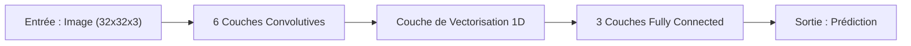
```mermaid
flowchart LR
    A["Entrée : Image (32x32x3)"] --> B["6 Couches Convolutives"]
    B --> C["Couche de Vectorisation 1D"]
    C --> D["3 Couches Fully Connected"]
    D --> E["Sortie : Prédiction"]
```

Cette organisation va lui permettre de classifier les images en entrée. 

#### 1.C.1. Les couches convolutives

Les couches convolutives du modèle vont permettre de pouvoir faire ressortir les caractéristiques de l'image en entrée. En effet, chaque couche de convolution de notre modèle est composée des éléments suivants successivement :

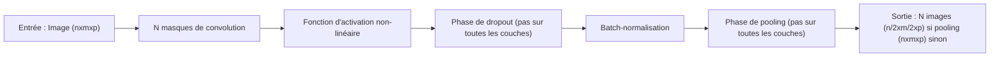
```mermaid
flowchart LR
    A["Entrée : Image (nxmxp)"] --> B["N masques de convolution"]
    B --> C["Fonction d'activation non-linéaire"]
    C --> D["Phase de dropout (pas sur toutes les couches)"]
    D --> E["Batch-normalisation"]
    E --> F["Phase de pooling (pas sur toutes les couches)"]
    F --> G["Sortie : N images (n/2xm/2xp) si pooling (nxmxp) sinon"]
```

**Masque de convolution :** Chaque couche de convolution possède un certain nombre de masques de convolution différents. Ces masques correspondent à des matrices de taille généralement 3x3 avec une profondeur de 3 matrices (pour les couleurs RGB) qui vont naviguer sur l'ensemble des pixels de l'image d'entrée. Ainsi, des produits scalaires vont être réalisés entre les valeur du masque convolutionnel et les valeurs des pixels de l'image d'entrée. De cette manière, une nouvelle image est créée dont les valeurs de chaque pixel équivaut au produit scalaires du pixel correspondant sur l'image d'entrée par la valeur de la matrice du masque convolutionnel. Ainsi, on fabrique autant de nouvelles images qu'il y a de masques convolutionnels différents sur la couche. De cette manière, les caractéristiques de l'image vont commencer à ressortir sur les nouvelles images ainsi créées. 

**Fonction d'activation :** La fonction d'activation permet d'introduire de la non-linéarité dans les calculs réalisés par les neurones du réseau. Il existe plusieurs fonction d'activation, toutes non-linéaires, mais, dans notre cas, nous utilisons la fonction ReLU (Rectified Linear Unit. Cette fonction produit une sortie de 0 pour tout x∈]-∞;0] et x pour tout x∈[0;+∞[. Elle est simple à calculer donc tout à fait aux réseaux de neurones profonds. Elle permet une meilleure performance de calcul du réseau. C'est pourquoi elle est utilisée dans ce modèle.

**Dropout :** La notion de Dropout n'intervient pas à chaque couche convolutionnelle. Le dropout prend en argument une probabilité. En effet, pendant l'exécution du modèle, aléatoirement, la phase de Dropout va venir mettre à 0 plusieurs neurones avec une probabilité égale à la probabilité marquée en entrée. Cette phase permet notamment d'équilibrer l'entrainement du modèle et empêcher la prépondérance de certains paramètres devant d'autres. Cette phase va donc permettre "d'éteindre" certains neurones selon une certaine probabilité afin de ne pas les prendre en compte dans la suite des calculs pour diminuer leur importance. Cela permet donc d'équilibrer l'importance de tous les paramètres et donc d'optimiser la précision du modèle d'IA. Cette couche est notamment très utile lorsque l'on cherche à lutter contre le surapprentissage (overfitting) ou sous-apprentissage (underfitting) du modèle.

**Batch-normalisation :** Cette phase correspond à la normalisation des sorties selon des mini-batch de la couche convolutionnelle entre 0 et 1 pendant l'entraienement ce qui va permettre de stabiliser l'apprentissage du modèle et de poursuivre le travail de régularisation et d'équilibrage de l'ensemble des paramètres du modèle.

**Pooling :** Il s'agit de la phase finale de quelques couches convolutionnelles du modèle. Cette phase agit en tant que compression des données de sortie de la couche. En effet, en sortie de la couche, nous avons un certain nombre d'images provenant directement de l'image d'entrée égale au nombre de masques convolutionnels présents sur la couche. Afin de diminuer la taille des données du modèle, cette phase va compresser les différentes images de sorties en divisant notamment leur taille par 2 par le biais de l'utilisation d'une fonction maximum (Max-pooling). Pendant cette phase, on va reconstruire chaque image en prenant la valeur maximale des pixels présente dans un carré de (2x2)px. On compresse alors chacune des images de sortie. 

Le modèle d'IA possède au total 6 couches convolutives dont le nombre de masques convolutifs est multiplié par 2 toutes les 2 couches. Voici un schéma des couches convolutionnelles du modèle :

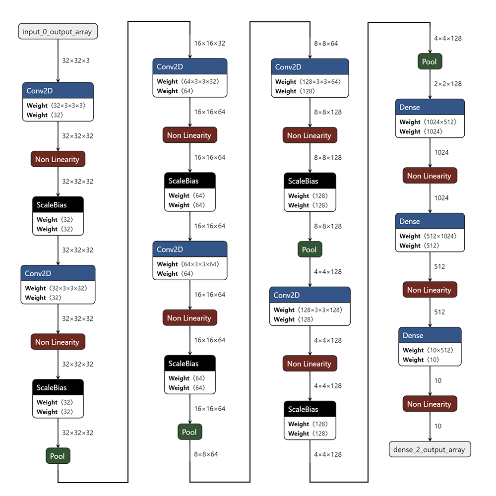

#### 1.C.2. Couche de vectorisation 1D

Maintenant que le processus a parcouru l'ensemble des couches convolutives, le modèle dispose de 128 images de taille (2x2)px. Chacune de ces images traite d'une caractéristique particulière de l'image d'entrée. Les 128 images permettent de décrire l'image d'entrée du modèle. Cependant, pour classifier l'image d'entrée du modèle et donc, traiter l'ensemble de ces 128 matrices 2x2, il est nécessaire d'utiliser une réseau de neurone de type "Fully Connected". Ce type de réseau s'organise selon des couches de neurones qui sont tous reliés entre eux : chaque neurone de la couche précédente est relié à tous les neurones de la couche suivante. Ce type de réseau est particulièrement adapté pour la classification de données. C'est pourquoi il constitue la 2ème partie du modèle que l'on analyse. Cependant, ce type de réseau admet, en entrée, des vecteurs de données. Or, actuellement, le modèle dispose de 128 tenseurs 2D de taille 2x2. Une couche de vectorisation 1D est alors introduite entre la partie convolutionnelle et la partie "Fully Connected" du modèle. Cette couche permet de fabriquer un vecteur 1D à partir de l'ensemble des 128 tenseurs 2D 2x2 du modèle. Ce vecteur 1D va alors être positionné en entrée de la partie Fully Connected.

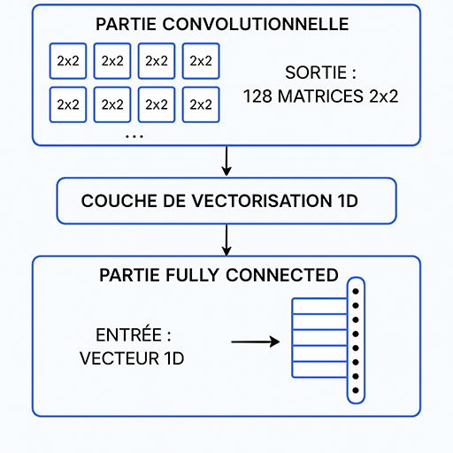

#### 1.C.3. Couches Fully Connected

Dans cette partie du modèle, les neurones vont réaliser des combinaisons linaires des données du vecteur d'entrée avec l'ajout de poids et y ajouter la fonction d'activation qui va permettre d'introduire une non-linéarité ce qui est essentiel au neurone pour son bon fonctionnement. 

Dans notre modèle, il y a 3 couches Fully Connected qui permettent de classifier l'image d'entrée du modèle. La première couche dispose de 1024 neurones ayant comme fonction d'activation la fonction "ReLU" que l'on a détaillé précédemment. Cette couche dispose également d'une phase de Dropout de probabilité 0.5 qui agit exactement de la même manière et de le même but que pour les couches convolutives. Une seconde couche est présente avec 512 neurones. Celle-ci est identique structurellement parlant à la première couche. Enfin, le modèle possède une 3ème et dernière couche qui possède autant de neurones que de classe de sortie de la banque CIFAR-10. En effet, cette dernière couche va permettre de produire un vecteur de probabilités associées à chacune des classes pour lesquels l'image d'entrée du modèle pourrait appartenir. La fonction d'activation utilisée pour réaliser cela est la fonction "softmax" qui est tout à fait adaptée à cela. L'image est classée dans la classe pour laquelle le modèle d'IA a fournit la probabilité la plus élevée d'appartenance.

On en conclut alors que notre modèle d'IA est bien adapté pour la classification d'image et notamment celles de la banque CIFAR-10.

## 2. Étude du microcontrôleur cible

Maintenant que nous avons pu analyser le modèle d'IA de classification des images de la banque CIFAR-10, notre objectif va être de déterminer son embarquabilité dans la carte choisie au départ.

Tout d'abord, nous avons choisis d'utiliser la carte STM32L4R9 Discovery Kit qui possède les caractéristiques techniques suivantes :

- **MCU :** STM32L4R9AII6
- **Performances :** 120 MHz/150 DMIPS
- **Taille Flash :** 2 Mo
- **Taille SRAM :** 640 ko

Afin de pouvoir embarqué le modèle d'IA sur cette carte, il nous faut prendre en compte des considérations techniques importantes qui sont la taille de la mémoire Flash et de la SRAM de la carte par rapport à la taille du modèle à embarquer et également la performance du MCU pour qu'il soit suffisamment performant pour exécuter le modèle d'IA. En effet, dans le processus d'implémentation du modèle d'IA dans la carte, l'ensemble des poids et la structure de l'ensemble du modèle vont être stockés dans la mémoire Flash de la carte tandis que les entrées/sorties du modèle, les activations intermédiaires et les variables temporaires vont être stockés dans la SRAM. Cependant, il faut également prendre en compte le fait que le modèle d'IA ne doit prendre toute la place de la mémoire de la carte. En effet, il faut pouvoir garder de la place en mémoire pour laisser l'utilisateur construire les différents programmes nécessaires à l'utilisation du modèle d'IA ou autres.

Il va donc falloir analyser l'embarquabilité du modèle sur la carte selon les différents critères que l'on a donnés.

## 3. Évaluation de l’embarquabilité du modèle initial

### 3.A. Constatation de la non-embarquabilité du modèle

A présent, notre objectif est de déterminer si le modèle est embarquable dans le microcontrôleur. Pour cela, nous avons utilisé l'extension CubeIA de CubeIDE pour implémenter le modèle sur la carte. Cette extension a commencé par analyser le modèle afin de déterminer s'il est embarquable ou non pour notre carte. Celui-ce a donc généré un rapport d'analyse dont voici un extrait ci-dessous :

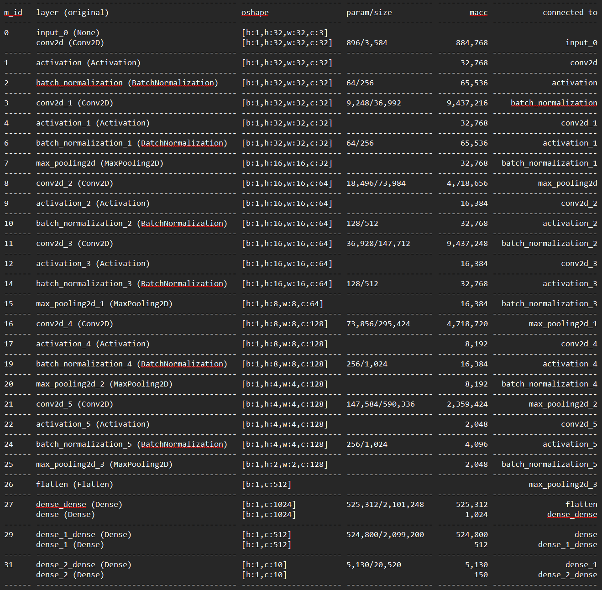

Cette analyse correspond au schéma du modèle de base suivant :

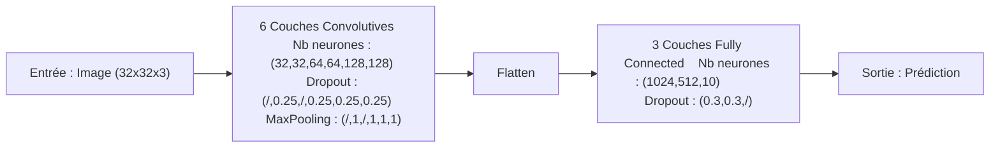
```mermaid
flowchart LR
    A["Entrée : Image (32x32x3)"] --> B["6 Couches Convolutives    Nb neurones : (32,32,64,64,128,128) Dropout : (/,0.25,/,0.25,0.25,0.25)    MaxPooling : (/,1,/,1,1,1)"]
    B --> C["Flatten"]
    C --> D["3 Couches Fully Connected    Nb neurones : (1024,512,10)            Dropout : (0.3,0.3,/)"]
    D --> E["Sortie : Prédiction"]
```

Egalement, voici les caractéristiques globales de stockage du modèle sur le microcontrôleur :

| Résultats | *MCU Flash* | *MCU RAM* | *Temps entrainement - (1 époque)* | *Précision (Accuracy) sur GPU externe* | *Précision (Accuracy) sur MCU cible* |
|-----------|---------|-------|----------------------|----------------------------------------|--------------------------------------|
| Valeurs | 5.12Mo / 2Mo | 148.56ko / 192ko | 6-7sec | 83.7% | Non-implémentable en l'état |

On observe clairement que le modèle est beaucoup trop volumineux pour le microcontrôleur. Le modèle dépasse de 256% la taille de la flash de la carte. Pour ce qui est de la RAM, le modèle semble plutôt adapté. Cependant, il prend à lui seul 77.38% de la RAM du microcontrôleur ce qui est beaucoup. Notre objectif va alors être de trouver des solutions pour optimiser le modèle afin qu'il utilise moins de place dans le microcontrôleur mais, sans que le modèle ne perde trop en précision. Ce modèle ne peut donc pas être déployé dans le microcontrôleur pour des raisons de taille trop importante prise dans la mémoire du MCU.

### 3.B. Analyse des ressources prises par le modèle

D'après l'analyse précédente, on observe que les 2 couches qui prennent le plus de place dans la Flash du MCU sont les 2 premières couches Denses (2 premières couches "Fully Connected"). En effet, à elles seules, elles représentent 82% de la taille du modèle. 

Egalement, on observe que plus il y a un nombre important de masques convolutifs sur une même couche, plus la taille prise par la couche va être importante. En effet, la dernière couche convolutive avec 128 paramètres a une taille 168 fois plus importante que la première couche convolutive avec 16 paramètres. Cette dernière couche convolutive représente également à elle seule 11.5% de la taille totale du modèle.

Que ça soit pour les couches Fully Connected ou les couches convolutives, l'ajout de chaque couche a un impact important sur la taille prise par le modèle final. Ainsi, il est important de s'interroger sur la pertinance de la présence de l'ensemble des couches pour pouvoir en supprimer afin de diminuer la taille du modèle.

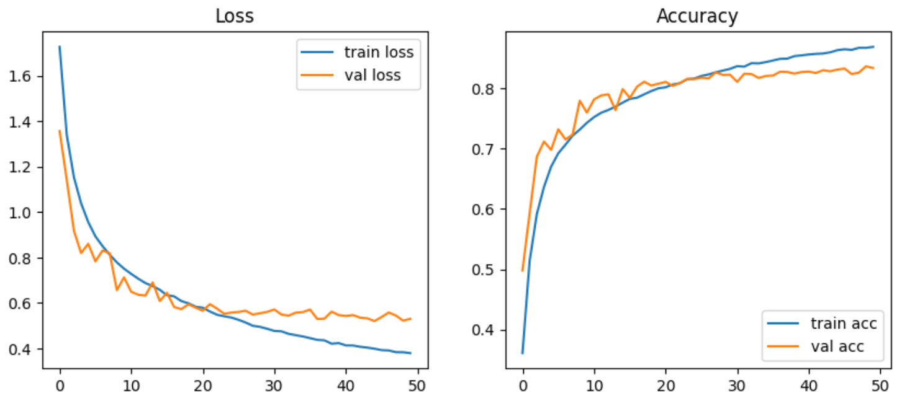

## 4. Conception et implémentation de nouveaux modèles plus optimisés

Maintenant que nous avons pu analyser et étudier le modèle de base, nous souhaitons nous donner pour objectif d'optimiser ce modèle de base afin de diminuer sa taille Flash et RAM le plus possible en impactant le moins possible les performances d'Accuracy du modèle de base. Pour réaliser cela, nous allons détailler, dans la suite, l'ensemble des étapes et du processus de réflexion qui nous ont amené à concevoir un modèle plus optimisé que le modèle de base permettant d'être embarqué sur un microcontrôleur et d'avoir un temps d'entrainement court. 

### 4.A. Conception et implémentation d'un 1er modèle - Remplacement de la couche Flatten (Modèle 1 et Modèle 1-1)

Pour réaliser la première optimisation du modèle de base, nous avons choisi de commencer par le remplacement de la couche "Flatten" par la couche "GlobalAveragePooling2D". "Flatten" correspond à la couche de vectorisation 1D que l'on a décrit précédemment. Cette couche aligne l'ensemble des données et paramètres de chaque image dans un vecteur 1D. Les données sont placées côte à côte. Dans le cas du modèle de base, le set d'images entrant dans la couche "Flatten" a pour taille (2,2,128) c'est-à-dire 128 images de taille 2x2 pixels. Il y a donc, au total, 128x2x2 = 512 paramètres à aligner dans un vecteur 1D. La couche "Flatten" va alors former un vecteur de sortie de taille 512. Le nombre de paramètres va alors être multiplié par le nombre de neurones dans chaque couche ce qui va entrainer une large augmentation de la mémoire RAM et de la mémoire Flash. Par exemple, pour la première couche "Dense" qui contient 1024 neurones, on aurait déjà 1024x512 = 524 288 paramètres. Notre objectif est donc de diminuer le nombre de paramètres propagés dans la partie "Fully Connected" du modèle.

La couche "GlobalAveragePooling2D", pour sa part, utilise une autre méthode de vectorisation des données. En effet, cette couche va réaliser la moyenne de l'ensemble des valeurs des pixels d'une image et générer, en sortie, une valeur moyenne par image. Ainsi, appliqué au modèle de base, cette couche recevrait un set d'images de taille (2,2,128) et générerait, en sortie, une vecteur 1D de taille 128. En effet, le set d'images contient 128 images de 2x2 pixels chacune. La couche "GlobalAveragePooling2D" va faire une moyenne de l'ensemble des paramètres de chacune des images. Ainsi, au lieu d'aligner les 4 paramètres de chacune des images, cette couche ne va aligner qu'un seul paramètre par image correspondant à la moyenne des 4 paramètres qui constituent l'image à la base. On obtient alors un vecteur 1D de 128 paramètres en sortie de cette couche. 

Voici le schéma du nouveau modèle intégrant la nouvelle couche de vectorisation 1D :

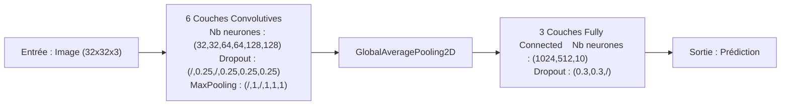
```mermaid
flowchart LR
    A["Entrée : Image (32x32x3)"] --> B["6 Couches Convolutives    Nb neurones : (32,32,64,64,128,128) Dropout : (/,0.25,/,0.25,0.25,0.25)    MaxPooling : (/,1,/,1,1,1)"]
    B --> C["GlobalAveragePooling2D"]
    C --> D["3 Couches Fully Connected    Nb neurones : (1024,512,10)            Dropout : (0.3,0.3,/)"]
    D --> E["Sortie : Prédiction"]
```

Voici les courbes de Loss et d'Accuracy associé aux entrainements et aux tests du modèle ainsi optimisé :

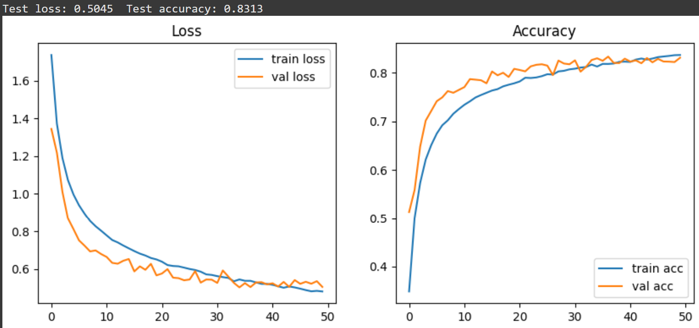

En analysant les courbes de Loss et d'Accuracy, par comparaison avec le modèle de base, on remarque que la nouvelle couche "GlobalAveragePooling2D" permet de rendre le modèle plus résistant face à l'overfitting (ce nouveau modèle n'a plus d'overfitting tandis que le modèle de base en a). Egalement, cette couche tend à améliorer l'Accuracy du modèle puisqu'elle est à plus de 83%. Cette première optimisation est donc validée.

Egalement, grâce à l'optimisation de la couche "Flatten" par remplacement de la couche "GlobalAveragePooling2D", on a divisé par 4 le nombre de paramètres entrant dans la partie "Fully connected" du CNN ce qui a pour conséquence une diminution de 29.1% de la taille du modèle dans la Flash. Le nouveau modèle a donc une taille de 3.63 Mo en Flash et une précision de 83.13%.

En réalisant l'analyse de l'importation du nouveau modèle sur CubeAI adapté à notre MCU cible, les résultats montrent toujours que la taille en Flash est trop importante même si elle a diminué et la taille en RAM est correcte même si trop importante. En effet, notre modèle occupe 77.5% de la RAM totale ce qui ne laisse que peu de place à des applications utilisateurs en plus et au fonctionnement du système lui-même.

| Résultats | *MCU Flash* | *MCU RAM* | *Temps entrainement - (1 époque)* | *Précision (Accuracy) sur GPU externe* | *Précision (Accuracy) sur MCU cible* |
|-----------|---------|-------|----------------------|----------------------------------------|--------------------------------------|
| Valeurs | 3.64Mo / 2Mo | 148.71ko / 192ko | 7sec | 83.13% | Non-implémentable en l'état |

On a remarqué que le remplacement de la couche "Flatten" a augmenté la taille du modèle en RAM de 0.15ko et son temps d'entrainement global de 0.3-0.5 secondes. En effet, la couche "GlobalAveragePooling2D" réalisant plus de calculs en faisant les moyennes des paramètres des images que la couche "Flatten" qui ne fait qu'aligner les paramètres dans un vecteur, ceci explique ces effets. 

### 4.B Conception et implémentation d'un 2ème modèle - Suppression de couches et neurones superflus (Modèle 2, Modèle 2-1 et Modèle 2-2)

#### 4.B.1. Suppression de couches superflus (Modèle 2)

Nous souhaitons à présent commencer l'optimisation du nouveau modèle précédent en supprimant des couches et neurones qui pourraient être superflus dans le modèle. Pour cela, nous avons analysons le nombre de paramètres par couche dans le modèle. En effet, notre objectif serait de supprimer le plus de paramètres possible ce qui limiterait la taille prise par notre modèle. 

Pour commencer, nous supprimons les 2 dernières couches convolutives qui comportent chacune 128 neurones du CNN et qui représentent, à elles seules, 17.3% de la taille totale du modèle. Le schéma du modèle devient alors : 

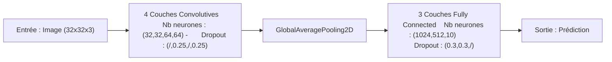
```mermaid
flowchart LR
    A["Entrée : Image (32x32x3)"] --> B["4 Couches Convolutives    Nb neurones : (32,32,64,64) -       Dropout : (/,0.25,/,0.25)"]
    B --> C["GlobalAveragePooling2D"]
    C --> D["3 Couches Fully Connected    Nb neurones : (1024,512,10)            Dropout : (0.3,0.3,/)"]
    D --> E["Sortie : Prédiction"]
```

Puis, nous faisons le choix de supprimer la premère couche "Dense" qui comporte 1024 neurones et qui représente, à elle seule, plus de 50% de la taille totale du modèle. Le schéma du modèle devient alors : 

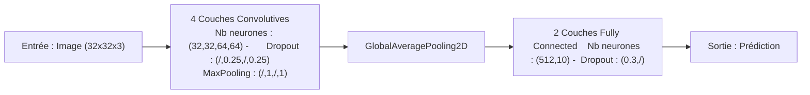
```mermaid
flowchart LR
    A["Entrée : Image (32x32x3)"] --> B["4 Couches Convolutives    Nb neurones : (32,32,64,64) -       Dropout : (/,0.25,/,0.25)    MaxPooling : (/,1,/,1)"]
    B --> C["GlobalAveragePooling2D"]
    C --> D["2 Couches Fully Connected    Nb neurones : (512,10) -  Dropout : (0.3,/)"]
    D --> E["Sortie : Prédiction"]
```

On souhaite entrainer ce nouveau modèle afin de le tester pour évaluer l'impact qu'a eu la suppression de l'ensemble de ces couches et neurones. Voici les courbes de Loss et d'Accuracy de ce nouveau modèle :

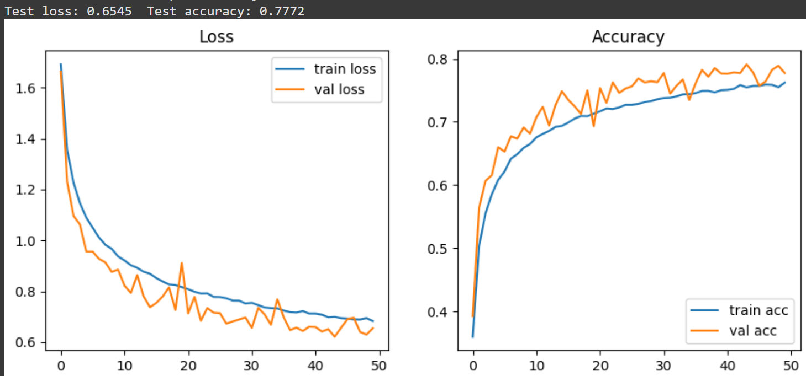

On remarque que le modèle possède une Accuracy (de 77%) plus basse que le modèle précédent et qu'il n'y a pas d'overfitting, mais, que le modèle est moins efficace sur les données d'entrainement que sur les données de test. Egalement, on a choisit de l'intégrer sur CubeAI afin de vérifier la taille Flash et RAM que ce modèle prendrait sur le MCU cible et voici les résultats obtenus :

| Résultats | *MCU Flash* | *MCU RAM* | *Temps entrainement - (1 époque)* | *Précision (Accuracy) sur GPU externe* | *Précision (Accuracy) sur MCU cible - (100 premières images)* |
|-----------|---------|-------|----------------------|----------------------------------------|-------------------------------------------------------------|
|  Valeurs  | 425.8Ko / 2Mo | 145.93ko / 192ko | 5-6sec | 77.72% | 76% |

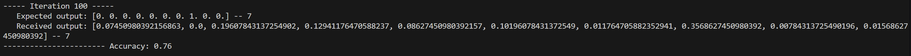

On remarque que la taille prise par ce nouveau modèle dans la Flash est bien moindre par rapport au précédent modèle. En effet, en supprimant des couches au modèle, on a également supprimé des neurones. En sachant que le nombre de paramètres d'entrée d'une couche va être multiplié par le nombre de neurones présents (car chacun des neurones reçoit l'ensemble des paramètres à leur entrée), cela augmente considérablement le nombre de paramètres total présent dans le modèle. En supprimant des couches et, par conséquent, des neurones, on réduit considérablement le nombre de paramètres stockés dans la mémoire Flash. On remarque que l'on a diminué la mémoire RAM de 2.78 Ko et que le temps d'entrainement a également diminué de 1-1.5 secondes par rapport au modèle précédent. Cela s'explique par la simplification du modèle que l'on produit en supprimant des couches et des neurones. Comme il y a moins de paramètres à modifier, l'entrainement est alors plus rapide.

#### 4.B.2. Ajustement du Dropout pour l'entrainement (Modèle 2-1)

Comme on l'a vu dans les résultats du modèle précédent, le modèle ne s'entraine pas assez ce qui explique pourquoi le modèle est plus précis sur les données de validation plutôt que sur celles d'entrainement. Mais, cela signifie également que l'on peut encore gagner en précision sans modifier quelque couche ou neurone que se soit. Pour augmenter l'apprentissage du modèle, nous devons augmenter le nombre de neurones qui fournissent des résultats pendant l'entrainement. Le paramètre qui agit justement sur le nombre de neurones qui fournissent des résultats pendant l'entrainement est le Dropout. Il nous faut diminuer la valeur du Dropout.

Nous allons donc modifier en diminuant les valeurs de probabilité dans les couches de "Dropout" afin qu'il y ait moins de neurones éteint aléatoirement pendant l'entrainement. Ceci va alors permettre au modèle de mieux apprendre sur les données d'entrainement car il aura plus de neurones actifs disponibles et donc, d'améliorer son Accuracy globale. Pour ajuster les bonnes valeurs de Dropout, nous avons réalisé une bonne dizaine de tests afin d'arriver à la conclusion que l'ensemble des probabilités des couches "Dropout" doit être fixé 0.2 qui est la valeur la plus optimale pour l'apprentissage de notre modèle. Voici donc le schéma représentatif de notre modèle 2-1 :

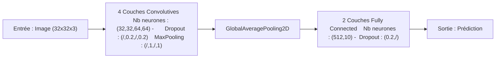
```mermaid
flowchart LR
    A["Entrée : Image (32x32x3)"] --> B["4 Couches Convolutives    Nb neurones : (32,32,64,64) -       Dropout : (/,0.2,/,0.2)    MaxPooling : (/,1,/,1)"]
    B --> C["GlobalAveragePooling2D"]
    C --> D["2 Couches Fully Connected    Nb neurones : (512,10) -  Dropout : (0.2,/)"]
    D --> E["Sortie : Prédiction"]
```

On souhaite maintenant entrainer ce nouveau modèle afin de vérifier que la modification de la valeur des Dropout a bien corriger le sous-apprentissage. Voici les courbes de Loss et d'Accuracy obtenues :

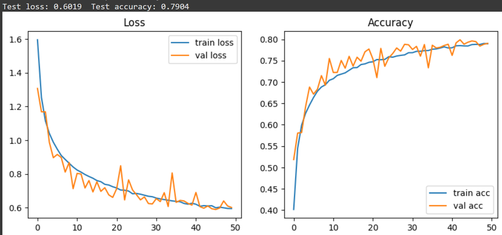

On remarque que l'Accuracy du modèle a augmenté de 77% à 79% donc, très proche de l'Accuracy initial qui était de 80%. On remarque également qu'il n'y a pas d'overfitting et que le modèle a bien atteint son point optimal d'apprentissage. La méthode de correction par variation du taux de Dropout a donc bien fonctionné.

| Résultats | * MCU Flash* | *MCU RAM* | *Temps entrainement - (1 époque)* | *Précision (Accuracy) sur GPU externe* | *Précision (Accuracy) sur MCU cible - (100 premières images)* |
|-----------|---------|-------|----------------------|----------------------------------------|-------------------------------------------------------------|
|  Valeurs  | 425.8Ko / 2Mo | 145.93ko / 192ko | 5-6sec | 79.04% | 82% |

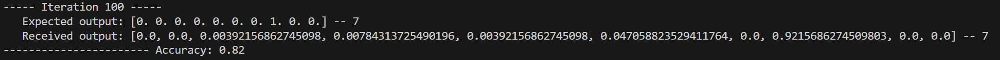

On remarque que faire varier la valeur du Dropout ne modifie pas la taille du modèle dans les mémoires. Cependant, durant nos différents tests de modèles, on a pu remarquer que plus la valeur du Dropout est élevée, plus le temps d'entrainement diminue. Cela découle directement du fait que le Dropout "éteint" des neurones en les mettant à 0 pendant l'entrainement ce qui diminue le nombre de paramètres et donc accélère l'entrainement. Dans notre cas, le temps d'entrainement a bien diminué, mais, très faiblement du fait de la faible variation de valeur du Dropout que nous avons appliqué.

#### 4.B.3. Suppression de neurones et ajout du Pooling (Modèle 2-2)

Maintenant que nous avons supprimé des couches du modèle, nous allons supprimer des neurones aux couches restantes. En effet, après avoir réalisé différents tests sur l'optimisation du modèle précédent, nous sommes arrivé à la conclusion que 4 couches semble être le nombre de couche idéal pour notre cas d'utilisation. Retirer plus de couches empêcherait le modèle de bien récupérer suffisamment de détails sur les images entrantes ce qui ferait diminuer la précision du modèle. Nous allons donc supprimer des neurones au modèle.

Par analyse des ressources prises par chaque couche, on a pu remarquer que les 2 couches de 64 neurones sont responsables de la majorité de la taille dans la Flash du modèle précédent. Il en est de même pour la première couche Dense qui comprend 512 neurones. Nous allons donc commencer par réduire le nombre de neurones de la première des 2 couches Denses restantes de 512 à 256 neurones afin de diviser par 4 le nombre de paramètres vectorisés provenant des couches convolutives. Egalement, nous réduisons le nombre de neurones des 2 dernières couches de convolution passant de 64 à 32 neurones chacune. 

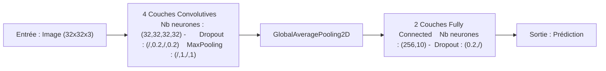
```mermaid
flowchart LR
    A["Entrée : Image (32x32x3)"] --> B["4 Couches Convolutives    Nb neurones : (32,32,32,32) -       Dropout : (/,0.2,/,0.2)    MaxPooling : (/,1,/,1)"]
    B --> C["GlobalAveragePooling2D"]
    C --> D["2 Couches Fully Connected    Nb neurones : (256,10) -  Dropout : (0.2,/)"]
    D --> E["Sortie : Prédiction"]
```

On réalise l'entrainement de ce nouveau modèle afin de visualiser les effets de ces suppressions de neurones :

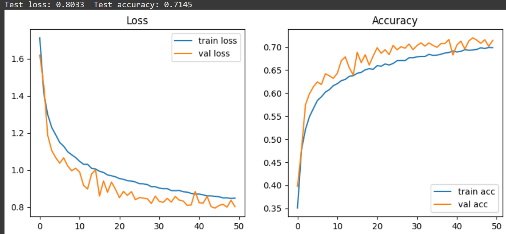

On remarque directement que le modèle est en sous-apprentissage. En effet, le modèle est plus performant sur les données de validation que d'apprentissage. L'objectif va être d'augmenter l'apprentissage du modèle pendant l'entrainement. Ainsi, comme précédemment, il va s'agir de diminuer la valeur des phases de Dropout. On réalise plusieurs tests et on en arrive à la configuration du modèle suivant :

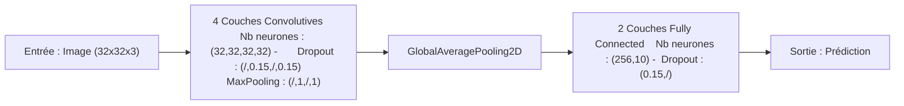
```mermaid
flowchart LR
    A["Entrée : Image (32x32x3)"] --> B["4 Couches Convolutives    Nb neurones : (32,32,32,32) -       Dropout : (/,0.15,/,0.15)    MaxPooling : (/,1,/,1)"]
    B --> C["GlobalAveragePooling2D"]
    C --> D["2 Couches Fully Connected    Nb neurones : (256,10) -  Dropout : (0.15,/)"]
    D --> E["Sortie : Prédiction"]
```

Voici les résultats de l'entrainement :

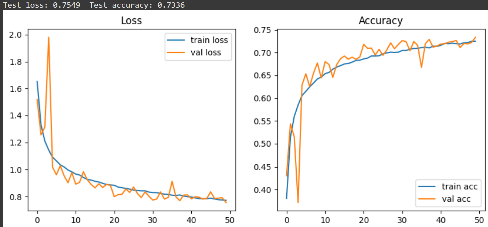

On remarque que le modèle apprend correctement et à un bon rythme. Egalement, on remarque que la précision a augmenté par rapport à la configuration précédente passant de 71% à 73%. Cependant, la précision du modèle n'est pas encore suffisante, il nous faut encore l'améliorer. Dans cet objectif, il nous faut trouver un levier d'amélioration qui permettrait au modèle d'augmenter sa précision tout n'impactant pas les ressources mémoires prises par le modèle ainsi que son temps d'entrainement. Ce levier a tout été trouvé dans l'ajout d'une phase de Pooling de type "MaxPooling".

Une phase de "Pooling" agit comme un compresseur de la donnée d'entrée. En effet, dans notre cas, la taille en pixel des images entrante de cette phase est divisée par 2. Ceci permet d'améliorer la qualité des caractéristiques uniques à chaque image que le modèle a appris à reconnaitre durant son apprentissage pour pouvoir bien classifier les images entrantes. Dans notre modèle, nous utilisons des "MaxPooling". Il s'agit d'un type de compression d'une image particulière. En effet, nous la paramètrons sur des zones de 2x2 pixels soit 4 pixels en tout composant chacune de ces zones. Cette phase va appliquer ces zones de 2x2 pixels aux images entrantes. Ces zones viennent glisser sur toute la surface des images entrantes. La règle de "MaxPooling" correspond au fait de ne retenir que le pixel de valeur maximal à chacune de ces zones sur l'image. Ainsi, au sein d'une zone locale, le seul pixel d'une valeur maximale sera retenu et les autres pixels seront laissés. Ainsi, les images de sortie de cette phase auront une taille en pixel divisée par 2.

Cette phase de "MaxPooling" permet de diminuer le nombre de paramètres à traiter au sein des couches de neurones grâce au phénomène de compression qu'elle génère. Ainsi, les ressources prises par le modèle auront tendance à diminuer et la vitesse d'entrainement sera plus également court. De plus, en ne retenant que les valeurs maximales, cela permet au modèle de ne retenir que les caractéristiques les plus importantes de l'image et d'oublier les détails non important. Ainsi, cela va permettre au modèle d'améliorer sa précision car il sera en possession de caractéristiques plus distinctives pour classer les images. Enfin, le modèle devient plus robuste aux petites translations et au bruit sur l'image. Cette phase est tout à fait bénéfique pour notre modèle.

Nous faisons donc le choix d'ajouter une phase de "MaxPooling" sur la deuxième couche convolutive afin d'améliorer la précision du modèle. Voici alors le schéma structurel du modèle :

```mermaid
flowchart LR
    A["Entrée : Image (32x32x3)"] --> B["4 Couches Convolutives    Nb neurones : (32,32,32,32) -       Dropout : (/,0.15,/,0.15)    MaxPooling : (/,1,1,1)"]
    B --> C["GlobalAveragePooling2D"]
    C --> D["2 Couches Fully Connected    Nb neurones : (256,10) -  Dropout : (0.15,/)"]
    D --> E["Sortie : Prédiction"]
```

Nous n'avons ajouté qu'une seule phase de MaxPooling supplémentaire car, en réalisant des tests, nous avons pu constater qu'ajouter 2 phases de MaxPooling supplémentaires réduisait l'Accuracy du modèle. A présent, nous réentrainons notre nouveau modèle afin de visualiser l'effet de l'ajout d'une phase de MaxPooling :

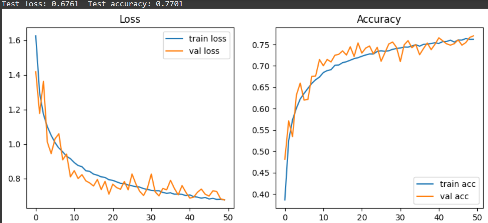

Nous remarquons l'apprentissage du modèle reste correct et qu'il n'y a pas d'overfitting. Egalement, on remarque que l'on a réussi à augmenter la précision du modèle de 73% à 77% soit 4% de plus. Enfin, nous implémentons ce nouveau modèle sur le MCU cible en utilisant CubeAI et voici les résultats obtenus :

| Résultats | *MCU Flash* | *MCU RAM* | *Temps entrainement - (1 époque)* | *Précision (Accuracy) sur GPU externe* | *Précision (Accuracy) sur MCU cible - (100 premières images)* |
|-----------|---------|-------|----------------------|----------------------------------------|-------------------------------------------------------------|
|  Valeurs  | 174.25Ko / 2Mo | 146.14ko / 192ko | 5sec | 77.01% | 76% |

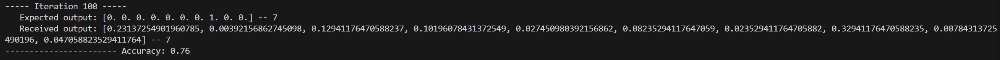

Nous avons réussi à diviser la taille en Flash du modèle précédent (modèle 2-1) par plus de 2 en supprimant des neurones aux couches existantes. Cependant, la taille en mémoire RAM prise par le modèle a un petit peu augmenté de 0.21 Ko. Egalement, l'ajout de la phase de "MaxPooling" a permis d'augmenter la vitesse d'entrainement du modèle. Il s'entraine avec 0.5s de moins que sa version précédente.

### 4.C Conception et implémentation d'un 3ème modèle - Modification du mode d'entrainement (Modèle 3 et Modèle 3-1)

#### 4.C.1. Variation du Learning Rate (Modèle 3)

Maintenant que nous avons supprimé des couches du modèle et ajouté une phase de "MaxPooling", nous allons continuer à supprimer des neurones aux couches restantes. Par analyse des ressources prises par chaque couche, comme les couches Dense prennent beaucoup de ressources, on a choisi de diminuer le nombre de neurones à la première couche Dense de 256 à 128. Egalement, on a choisi de diviser par 2 le nombre de neurones des 2 premières couches de convolution. Ceci aura pour effet de diminuer la taille en mémoire Flash prise par le modèle et d'augmenter la vitesse d'entrainement.

Après avoir supprimé les différents neurones, nous avons réalisé différents entrainements afin de déterminer les valeurs les plus optimales du Dropout afin que l'apprentissage du modèle se réalise correctement. 

Voici le nouveau schéma structurel du nouveau modèle :

```mermaid
flowchart LR
    A["Entrée : Image (32x32x3)"] --> B["4 Couches Convolutives    Nb neurones : (16,16,32,32) -       Dropout : (/,0.1,/,0.1)    MaxPooling : (/,1,1,1)"]
    B --> C["GlobalAveragePooling2D"]
    C --> D["2 Couches Fully Connected    Nb neurones : (128,10) -  Dropout : (0.1,/)"]
    D --> E["Sortie : Prédiction"]
```

Nous réalisons l'entrainement de notre modèle afin de visualiser les effets qu'ont la suppression des neurones :

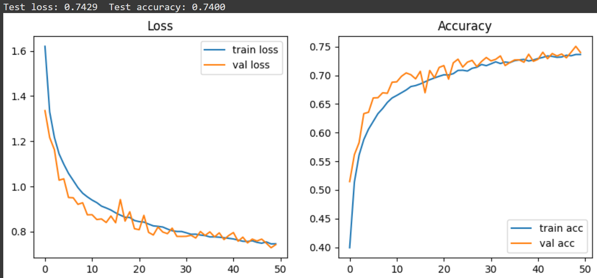

Notre objectif est alors d'augmenter la précision du modèle. Cependant, ajouter une couche de "MaxPooling" aura pour effet de faire diminuer l'accuracy du modèle par rapport au modèle présent. Nous avons utilisé l'ensemble des éléments structurels du modèle de type VGG pour augmenter la précision du modèle. 

A présent, nous souhaitons nous tourner vers la modification du mode d'entrainement du modèle afin d'augmenter sa précision. L’entraînement d’un modèle d'IA consiste à amener ce modèle à apprendre à partir d’un ensemble de données afin qu’il soit capable de faire des prédictions en reconnaîssant des motifs de manière autonome. Ce processus repose sur un principe : le modèle effectue d’abord des prédictions aléatoires, puis compare ces prédictions aux valeurs réelles issues du jeu de données. L’écart entre les deux, appelé erreur ou fonction de perte ou Loss, indique dans quelle mesure le modèle s’est trompé. À partir de cette erreur, un algorithme d’optimisation, souvent basé sur la descente de gradient (rétropropagation du gradient), calcule la direction dans laquelle les paramètres internes du modèle (poids) doivent être ajustés pour réduire cette erreur. Le modèle répète cette opération un grand nombre de fois, en ajustant progressivement ses poids, jusqu’à atteindre un équilibre où les prédictions deviennent les plus précises possibles. Cela constitue l'ensemble du processus de la phase d'entraînement d'un modèle d'IA.

Ainsi, pendant l'entraînement, l'objectif est d'atteindre le minimum global de la Loss. L'ajustement des poids du modèle qu'il réalise pendant l'entrainement se fait par pas. Ce pas est appelé le Learning Rate. Il s'agit d'un paramètre numérique qui détermine l’amplitude de la modification des poids d’un modèle à chaque étape de l’entraînement, en fonction du gradient de la Loss. Il détermine donc la vitesse à laquelle un modèle ajuste ses poids au cours de l’entraînement. Plus précisément, à chaque itération, l’algorithme d’optimisation (rétropropagation du gradient) calcule la direction dans laquelle les poids doivent être modifiés afin de réduire la Loss. Le Learning Rate indique alors de combien ces poids doivent être déplacés dans cette direction.

Si le Learning Rate est trop élevé, les modifications des poids sont trop importantes, ce qui empêche le modèle de se stabiliser : il peut alors diverger, c’est-à-dire que la Loss ne diminue plus ou oscille sans jamais atteindre une valeur minimale. À l’inverse, si le Learning Rate est trop faible, les ajustements des poids deviennent trop faibles, et l’apprentissage progresse très lentement. Dans certains cas, le modèle peut même se bloquer dans un minimum local de la Loss avant d’avoir trouvé les valeurs de poids du minimum global qui minimisent réellement la Loss.

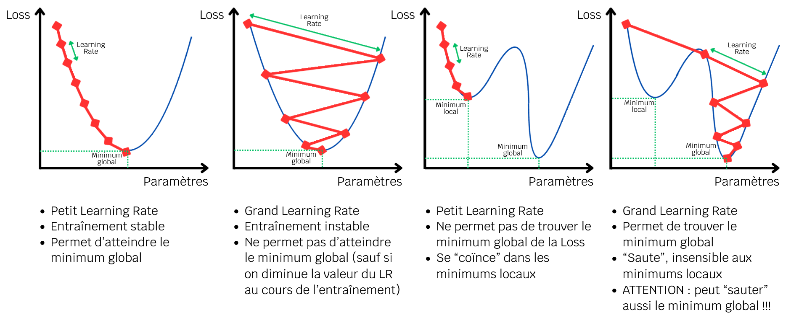

Ainsi, le choix du Learning Rate influence directement la rapidité et la qualité de la convergence du modèle vers un minimum de la Loss. Optimiser et adapter l'entrainement à un modèle d'IA revient donc en partie à optimiser la valeur du Learning Rate afin de trouver le minimum global de la Loss du modèle. Dans le cadre de l'optimisation de notre modèle, nous souhaitons donc modifier la valeur du Learning Rate. Actuellement, tous les modèles précédents ont été entraînés avec un Learning Rate fixe de 0.001. Nous avons réalisé plusieurs tests avec des Learning Rate différent dont 0.01. A cette valeur, l'entraînement était plus rapide et l'accuracy finale un peu plus importante qu'à 0.001. Cependant, l'entraînement était assez instable ce qui avait pour conséquence que l'accuracy finale oscillait beaucoup entre 71% et 78% ce qui n'est pas idéal.

Ainsi, nous avons pu constater qu'un Learning Rate de 0.001 était pratique pour la stabilité de l'entrainement mais provoquait une accuracy finale moins élevée. Un Learning Rate plus important à 0.01 était également pratique pour un meilleur entraînement du modèle et une meilleure accuracy finale mais au prix d'une assez forte instabilité des résultats. Par conséquent, nous avons fait le choix de faire varier le Learning Rate pendant l'entrainement du modèle afin de bénéficier des avantages de chacune des valeurs de Learning Rate. 

Au début, LR = 0.001, puis, LR augmente linéairement jusqu'à 0.01 par pas de 0.002 par époque, et enfin, diminue sur les époques suivantes progressivement jusqu'à un LR de 0.0001. Ainsi, en gardant la même structure du modèle que précédemment, on réalise l'entraînement de notre modèle en faisant varier le Learning Rate comme décrit précédemment. Voici les résultats de l'entrainement :

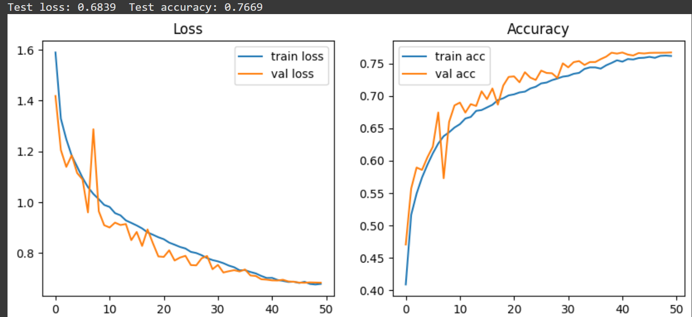

On remarque que l’entraînement s’est bien déroulé. Le modèle apprend bien. De plus, on remarque que la précision du modèle a bien augmenté par rapport à l’entraînement sans variation du Learning Rate en augmentant d’environ 3% passant de 74% à 76.7% environ 77%. En effet, ce résultat signifie que le minimum de la Loss trouvé pendant l’entraînement avec un Learning Rate fixe valant 0.001 est un minimum local. En augmentant la valeur du Learning Rate et en la faisant varier pendant le second entraînement, nous avons permis à l’algorithme d’optimisation (rétropropagation du gradient) de trouver un autre minimum à la Loss qui est, pour sa part, plus important. Ainsi, il pourrait s’agir, sans certitude, d’un minimum global. Egalement, la variation du Learning Rate pendant l’entraînement du modèle a permis de stabiliser l’entrainement.   

A présent, nous souhaitons implémenter notre modèle d'IA dans le microcontrôleur cible. Pour cela, nous allons utiliser CubeAi. Voici donc les différents résultats suite à cette implémentation :

| Résultats | *MCU Flash* | *MCU RAM* | *Temps entrainement - (1 époque)* | *Précision (Accuracy) sur GPU externe* | *Précision (Accuracy) sur MCU cible - (100 premières images)* |
|-----------|---------|-------|----------------------|----------------------------------------|-------------------------------------------------------------|
|  Valeurs  | 105.7Ko / 2Mo | 80.14ko / 192ko | 3-4sec | 76.99% | 78% |

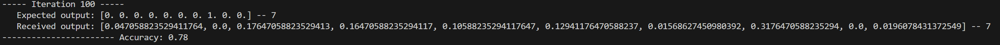

On remarque immédiatement que les ressources en RAM prises par le modèle d’IA dans le MCU ont considérablement diminué passant de 77.1% de RAM totale du MCU à 41.7% de la RAM totale. De cette manière, cela va permettre à un éventuel utilisateur de pouvoir intégrer une application en parallèle du modèle d’IA. La RAM du MCU ne sera pas saturé. Egalement, les ressources Flash prises par le modèle d’IA dans le MCU ont beaucoup diminué (presque divisés par 2 par rapport au modèle précédent). Enfin, le temps d’entraînement du modèle sur une époque a diminué de 1.5 secondes ce qui est considérable. Toutes ces observations peuvent être expliquées par le fait que l’on a supprimé de nombreux neurones au sein des différentes couches du modèle. De cette manière, nous avons simplifié la structure du réseau de neurones, nous avons diminué le nombre de paramètres à mettre à jour et à retenir, nous avons diminué le nombre de calculs réalisés par le MCU et, par conséquent, nous avons diminué le temps d’entraînement du modèle. Ce modèle est donc plus performant et optimisé que le modèle proposé initialement.

En terme de précision, nous pouvons remarquer que ce modèle a une précision inférieure de 0.02% par rapport au modèle précédent et de 3.15% par rapport au modèle initial. Dans le même temps, les ressources prises par le modèle en Flash et en RAM ont considérablement été diminué. En taille de Flash, celle-ci a presque été divisé par 2 par rapport au modèle précédent et divisé par 47.4 par rapport au modèle initial. En taille RAM, celle-ci a presque été divisé par 2 par rapport au modèle précédent et au modèle initial. Le temps d’entraînement sur une époque a été divisé par 2 par rapport au modèle initial. Ainsi, l’ensemble de l’amélioration de ces paramètres permettent de montrer que les optimisations du modèle sont pertinents malgré la perte de quelques pourcents.

Le modèle actuel que nous proposons correspond au modèle le plus équilibré, stable et optimisé que l’on a réalisé. C’est pourquoi, nous allons utiliser ce modèle pour la suite de nos manipulations et notamment en « Sécurité de l’Intelligence Artificielle ».

Dans l’interface de CubeAI, il y a une section qui nous permet d’activer une compression supplémentaire au modèle importé afin qu’il prenne moins de ressources. Après avoir testé les compressions HIGH et MEDIUM, la compression la plus optimale pour notre modèle est LOW. En effet, lors de la phase de tests, c’est la compression qui permet de réduire encore un peu plus la taille du modèle dans la Flash du MCU sans impacter la taille en RAM et la précision. Voici les résultats obtenus :

| Résultats | *MCU Flash* | *MCU RAM* | *Temps entrainement - (1 époque)* | *Précision (Accuracy) sur GPU externe* | *Précision (Accuracy) sur MCU cible - (100 premières images)* |
|-----------|---------|-------|----------------------|----------------------------------------|-------------------------------------------------------------|
|  Valeurs  | 91.96Ko / 2Mo | 80.14ko / 192ko | 3-4sec | 76.99% | 78% |

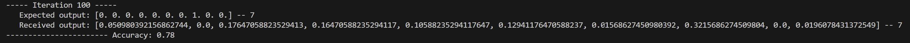

Ainsi, il s'agit du modèle le plus otpimisé que nous avons réalisé.

#### 4.C.2. Changement de la Loss (Modèle 3-1)

Nous souhaitons continuer à supprimer des neurones au modèle précédent afin de diminuer au maximum les ressources mémoires prises par le modèle dans le microcontrôleur. Ainsi, nous divisons par 2 le nombre de neurones sur les 2 dernières couches de convolution et nous adaptons les valeurs de Dropout à l’aide nombreux tests.  

Voici le schéma structurel du nouveau modèle :

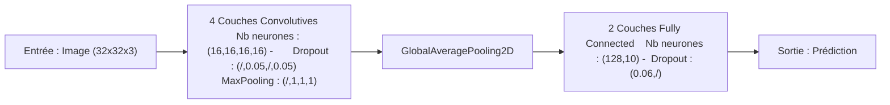
```mermaid
flowchart LR
    A["Entrée : Image (32x32x3)"] --> B["4 Couches Convolutives    Nb neurones : (16,16,16,16) -       Dropout : (/,0.05,/,0.05)    MaxPooling : (/,1,1,1)"]
    B --> C["GlobalAveragePooling2D"]
    C --> D["2 Couches Fully Connected    Nb neurones : (128,10) -  Dropout : (0.06,/)"]
    D --> E["Sortie : Prédiction"]
```

On entraîne le nouveau modèle afin de visualiser l'impact qu'a eu la suppression de ces neurones sur les performances du modèle. Pour l'entraînement, nous gardons la variation du Learning Rate précédente et nous ajustons les valeurs de Dropout :

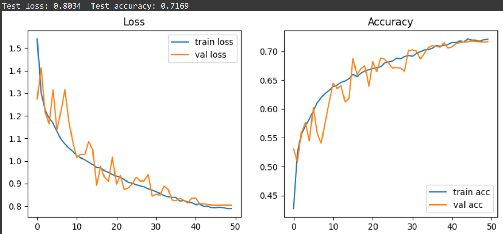

Nous remarquons que l’entraînement a bien été réalisé. La précision du modèle a beaucoup diminué par rapport au modèle précédent en passant de 76.7% à 71.6%. Cela signifie que l’on supprimé des neurones importants au fonctionnement du réseau de neurones. Notre objectif va donc être de trouver une solution pour améliorer la précision sans impacter les autres paramètres de performance.

En reprenant les derniers résultats d’entraînement du modèle précédent, on peut s’apercevoir d’une particularité. Alors que la Loss de validation est en situation d’overfitting,  l’accuracy de validation, pour sa part, en position supérieure par rapport à l’accuracy d’entraînement. Cela semble assez paradoxal.

Ceci peut s’expliquer par le fait que la Loss prend en compte non seulement si le modèle fait une bonne prédiction, mais aussi le degré de confiance dans cette prédiction. Si le modèle se montre trop sûr de lui sur l’ensemble d’entraînement c’est-à-dire qu’il attribue une probabilité très élevée à certaines classes, même lorsqu’il se trompe, alors la Loss augmente fortement, car une erreur très confiante est sévèrement pénalisée dans une fonction de Loss comme la Cross-Entropy. En revanche, sur l’ensemble de validation, le modèle peut être un peu plus “prudent” et moins confiant dans ses prédictions. Dans ce cas, même s’il fait globalement plus d’erreurs de calibration, il peut avoir une meilleure précision car il se trompe moins souvent sur la classe finale, bien que ses probabilités soient moins bien calibrées, ce qui augmente la Loss.

Dans notre situation, nous utilisons la fonction de Loss nommée « Categorical_CrossEntropy ». Cette Loss mesure l’écart entre la distribution de probabilités prédite par le modèle et la distribution réelle des classes. Elle possède la particularité de sanctionner très sévèrement les erreurs de classification du modèle d’IA lorsque celui-ci y attribue un indice de confiance très élevé. Elle base sa sévérité de sanction sur la confiance qu’un modèle d’IA a sur l’erreur qu’il commet. Cette fonction de Loss considère que chaque étiquette est parfaitement certaine : la classe correcte vaut 1 et toutes les autres 0. Cela pousse le modèle à essayer d’attribuer une probabilité de 1.0 à la classe vraie et 0.0 aux autres, ce qui le rend souvent trop confiant et donc plus susceptible de surapprendre.

Pour faire face à la particularité que l’on a relevé sur le modèle, on va modifier la fonction de Loss en lui rajoutant un paramètre supplémentaire : le Label_Smoothing. Ce paramètre permet de lisser les probabilités au sein du vecteur de labels en passant de [0, 0, 1, 0, 0] à [0.01, 0.01, 0.90, 0.01, 0.01] si ce paramètre vaut 0.1. De cette manière, le modèle n’essaie plus de forcer une certitude absolue, mais apprend une distribution de probabilité plus tolérante. Il devient alors moins confiant sur les prédictions du set d’entraînement, ce qui réduit la tendance à mémoriser les données. Ce paramètre empêche le modèle de devenir trop sûr de lui et l’aide à mieux généraliser sur les données de validation.
Ainsi, l’introduction de ce nouveau paramètre va nous permettre de résoudre la particularité remarquée. Nous ajoutons donc un Label_Smoothing de 0.1 et réentrainons le modèle afin de visualiser les effets que ce changement va avoir sur son entraînement : 

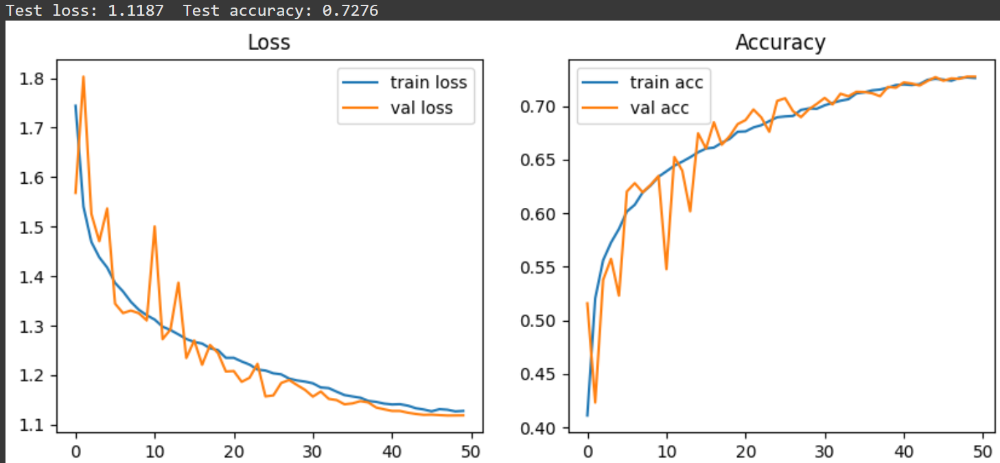

On remarque que l’entraînement est correctement réalisé et que la particularité a bien été corrigé. Egalement, la précision du modèle a bien augmenté de plus d’ 1%. Cela montre bien que le changement de la Loss a bien permis de corriger la particularité de comportement du modèle.

A présent, on souhaite implémenter ce modèle sur le MCU cible. Voici les résultats obtenus :

| Résultats | *MCU Flash* | *MCU RAM* | *Temps entrainement - (1 époque)* | *Précision (Accuracy) sur GPU externe* | *Précision (Accuracy) sur MCU cible - (100 premières images)* |
|-----------|---------|-------|----------------------|----------------------------------------|-------------------------------------------------------------|
|  Valeurs  | 61.31Ko / 2Mo | 80.14ko / 192ko | 3-4sec | 72.76% | 72% |

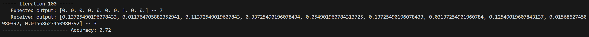

On remarque que l’on a bien diminué les ressources en Flash prise par le modèle dans le MCU. Cependant, les ressources en RAM n’ont pas diminué ni évolué. Egalement, le temps d’entraînement du modèle sur une époque n’a pas non plus diminué. Ainsi, à la vue de la forte diminution de la précision du modèle, cette optimisation n’est pas pertinante.

## 5. Sélection d'un nouveau microcontrôleur

Maintenant que nous avons réalisé l'optimisation du modèle d'IA de classification des images de la banque CIFAR-10 et que nous avons choisi le modèle 3 en tant que modèle optimisé, nous souhaitons sélectionner un nouveau microcontrôleur que la cible qui serait plus adapté à notre modèle. 

Tout d'abord, commençons par établir les critères de choix du microcontrôleur :

    - Taille RAM : supérieure ou égale à 2*80.14ko = 160.28ko
    - Taille Flash : supérieure ou égale à 2*91.96ko = 183.92ko
    - Fréquence de calcul : supérieure ou égale à 120 KHz

Ensuite, nous avons choisi de nous tourner vers un microcontrôleur de l'entreprise STMicroelectronics. En effet, leurs microcontrôleurs sont largement disponibles sur le marché et ils sont compatibles avec une grande partie de la technologie existante car ils peuvent être programmés de bout en bout entièrement. Enfin, cette entreprise a conçu un logiciel qui permet d'embarquer et compresser des modèles d'IA dans leurs microcontrôleurs et qui se nomme CubeAI. Il semble donc plus pertinent pour l'ensemble de ces raisons de choisir un de leurs microcontrôleurs.

En entrant sur le site de STMicroelectronics et en allant dans le répertoire des microcontrôleurs, on a cette classification : 

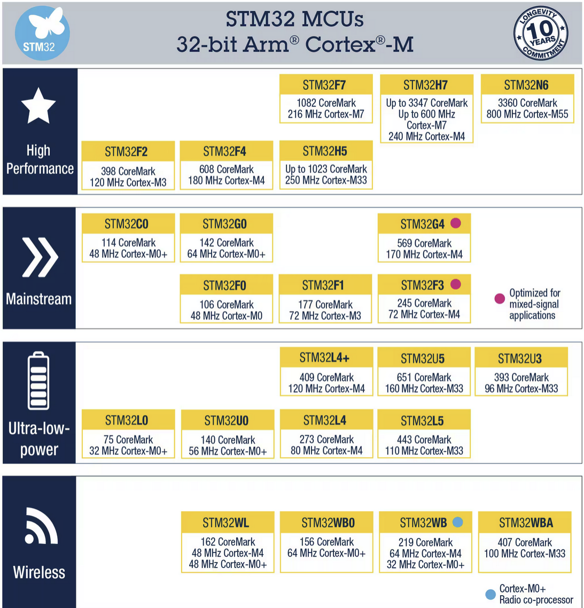

Dans le cadre d'un modèle d'IA, 2 catégories de performances seraient pertinantes : la catégorie "High Performance" et la catégorie "Ultra-low-power". Les microcontrôleurs de la catégories "High Performance" auront une fréquence d'horloge très élevée donc le temps d'inférence des modèles d'IA sera très réduit, ce qui est pertinent pour l'optimisation du fonctionnement de notre modèle. Cependant, cette catégorie de microcontrôleur requiert une forte consommation en énergie ce qui n'est pas pertinant dans le cadre d'une application industrielle. Ainsi, notre 1er critère sera la consommation énergétique qui devra être très faible. Nous allons donc choisir la catégorie "Ultra-low-power".

Dans cette catégorie, notre objectif va être de choisir un microcontrôleur avec les performances MCU les plus importantes. Pour cela, nous allons regarder 2 indicateurs : le score "CoreMark" qui évalue la puissance de calcul d'un coeur embarqué et la fréquence d'horloge du MCU. 

Notre objectif est de choisir le microcontrôleur avec un MCU qui possède une fréquence d'horloge la plus élevée possible afin que le MCU puisse réaliser les calculs de paramètres du modèle d'IA le plus rapidement possible. Cela va réduire considérablement le temps d'inférence qui est crucial pour l'optimisation de notre modèle d'IA. Egalement, notre objectif va être de choisir le MCU avec un score "CoreMark" le plus élevé possible. En effet, il mesure la capacité du MCU à exécuter du code typique d’un système embarqué, pas seulement la rapidité à laquelle son horloge tourne.

Dans notre cas, nous allons choisir la série de microcontrôleur "STM32U5". En effet, il possède le score "CoreMark" (651) et la fréquence d'horloge (160MHz) les plus élevés de toute la catégorie "Ultra-low-power".

Par la suite, plusieurs configurations de microcontrôleurs nous sont proposées (elles sont classées par ordre croissant de la taille de la configuration et il y en a plus que sur l'image ci-dessous) :

Actuellement, notre modèle d'IA optimisé fait une taille de 100 Ko en Flash et 80 Ko en RAM. Ainsi, dans l'optique de l'optimisation des coûts dans le cadre d'une application industrielle, il n'est pas nécessaire d'avoir une Flash de 2Mo ou plus. De même, il n'est pas nécessaire d'avoir une RAM de 786Ko. Une RAM de 274Ko est bien suffisante car notre modèle d'IA ne représenterait que 29.2% de la RAM totale ce qui laisse une place considérable pour les applications utilisateurs. Ainsi, nous allons nous intéresser aux configurations "STM32U535/545".

Après avoir sélectionné les configurations de type "STM32U535/545", une classification de microcontrôleurs nous est proposé :

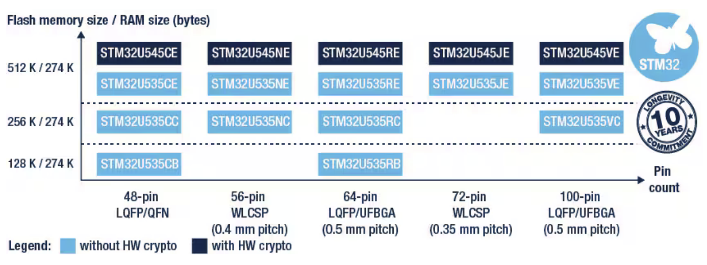

Comme explicité précédemment, dans un objectif d'optimisation des coûts autour du MCU, nous allons choisir la configuration avec 256Ko de Flash et 274Ko de RAM. Enfin, dans le cadre d'une application industrielle, ce microcontrôleur pourrait être associé à de nombreux capteurs, intégré dans un vaste réseau ou posséder de nombreuses liaisons avec d'autres microcontrôleurs. C'est pourquoi, nous souhaitons choisir le microcontrôleur avec un maximum de pins. Nous choisissons donc le microcontrôleur "STM32U535VC" qui possède 256 Ko de Flash, 274 Ko de RAM et 100 pins. Egalement, en terme de taille, il est quasisment aussi grand que les autres de la même configuration.

Ainsi, pour des raisons, d'application industrielle, d'optimisation des coûts, de performance du MCU, de taille des ressources Flash et RAM disponible, le nouveau microcontrôleur que nous choisissons est le microcontrôleur "STM32U535VCI6".

## 6. Sécurité de l'Intelligence Artificielle

### 6.A Pourquoi la sécurité d'un modèle d'IA est important pour l'embarqué

Sur une infrastructure serveur, le modèle bénéficie de mécanismes classiques de protection : contrôle d’accès, chiffrement, sauvegardes et supervision. Sur une carte de type STM32 utilisée en environnement embarqué, la situation est différente. La mémoire Flash qui contient les poids est accessible au microcontrôleur et parfois au port de débogage. Un attaquant disposant d’un accès physique peut ouvrir le boîtier ou réaliser une injection de faute sur le microcontrôleur en agissant sur la tension ou l’horloge.
Dans un contexte embarqué, le modèle est en compressé ou quantifié, ce qui fait qu’un seul bit peut porter une part significative d’information. Le réseau est de petite taille, car il a été optimisé pour la cible. La conséquence est qu’une attaque consistant à juste modifier quelques bits dans les poids peut suffire à provoquer une chute marquée de l’accuracy.

### 6.B Modèle de menace retenu

Le projet retient un scénario réaliste. On considère d’abord qu’un attaquant peut avoir un accès local au binaire ou à la carte. On considère ensuite qu’il ne cherche pas à réentraîner un modèle complet pour le remplacer, mais qu’il veut uniquement détériorer celui qui a été déployé. Enfin, on suppose qu’il est en mesure de modifier un petit nombre de valeurs en mémoire, par exemple à la faveur d’une mise à jour insuffisamment protégée, d’une corruption mémoire ou d’une attaque physique.

### 6.C Attaque réalisée : bit-flips sur les poids

L’attaque a été simulée sur le modèle entraîné en local, qui a ensuite servi à la partie embarquée. Avant toute corruption, les courbes d’entraînement montrent que le modèle atteint un niveau d’accuracy conforme aux attentes, compris entre 72 % et 75 %. 
L’attaque suit le principe suivant : le modèle entraîné est chargé, un nombre donné de poids est sélectionné (1, 3, 5, jusqu’à 30), un seul bit est inversé dans la représentation de chacun de ces poids, puis le modèle est réévalué sur le jeu de test afin de mesurer l’accuracy après corruption. Le résultat met en évidence une dégradation rapide des performances en fonction du nombre de bit-flips appliqués.

![curve.png]

![accuracy_vs_bfa.png]

Sans bit-flip, le modèle fonctionne de manière nominale et atteint environ 72 % d’accuracy. Avec seulement trois à cinq bit-flips, l’accuracy descend déjà en dessous de 40 %. Aux alentours de dix à douze bit-flips, elle se situe autour de 15 %. Au-delà de vingt-cinq à trente bit-flips, le comportement du modèle devient proche d’un choix aléatoire, autour de 10 % pour une tâche à dix classes. 
Cela montre que la modification de quelques dizaines de bits suffit à rendre le modèle pratiquement inutilisable. Dans un microcontrôleur dépourvu de correction d’erreurs mémoire et de mécanisme de vérification d’intégrité du modèle, ce scénario reste plausible. On peut donc conclure que le modèle est fonctionnel tant qu’il est intact, mais qu’il n’est pas durci et qu’il reste vulnérable à des modifications malveillantes de la mémoire contenant les poids.

### 6.D Implémentations de protections

Plusieurs mesures connues permettent de limiter ce type d’attaque ou au moins de le détecter. Une première famille de solutions repose sur le contrôle d’intégrité des poids au démarrage : calcul d’un hash ou d’un CRC de la zone mémoire contenant le modèle, stockage signé du modèle et vérification de cette signature avant utilisation, puis rechargement d’une copie saine en cas d’échec de la vérification. 
Une deuxième approche consiste à rendre le réseau tolérant aux fautes en l’entraînant avec des corruptions injectées de manière aléatoire sur les poids pendant l’apprentissage ; cette méthode améliore la robustesse mais augmente fortement la durée et le coût d’entraînement. 
Une troisième option vise à introduire une redondance légère, par exemple en dupliquant uniquement la dernière couche ou le classifieur pour effectuer un vote, ou en conservant une version de secours du modèle dans une zone mémoire distincte. 
Enfin, il est possible de durcir la plateforme en activant les protections mémoire du microcontrôleur, en restreignant l’accès au port de débogage et en limitant les écritures sur la zone où sont stockés les poids.

### 6.E Limitation du projet

La mise en application complète de ces protections n’a pas été réalisée dans le cadre de ce projet. L’entraînement avec fautes, l’ajout d’une vérification d’intégrité dans le code STM32 ou la duplication de couches n’ont pas été implémentés. 
Le facteur limitant a principalement été le temps d’entraînement en local, déjà élevé pour aboutir à un modèle de base satisfaisant. Multiplier les entraînements pour intégrer le durcissement aurait dépassé le temps disponible. Le travail effectué a donc consisté à démontrer qu’un bit-flip ciblé dégrade fortement l’accuracy, à relier cette vulnérabilité au contexte de l’IA embarquéee, et à proposer les contre-mesures les mieux adaptées. Les suites logiques sont les suivantes : intégrer au moins un contrôle d’intégrité dans le code embarqué, valider expérimentalement un entraînement sur une version réduite du réseau, puis comparer les courbes d’accuracy avant et après mise en place d’une défense.

