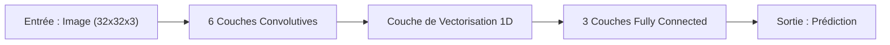
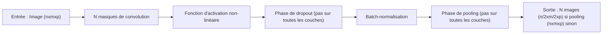
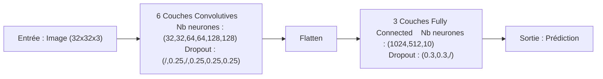
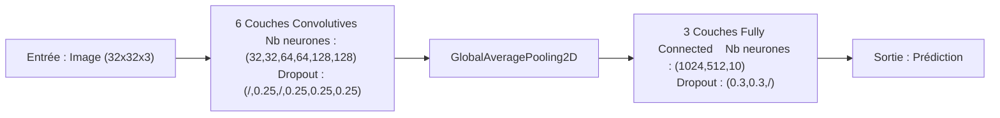
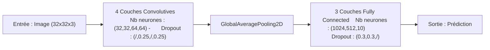
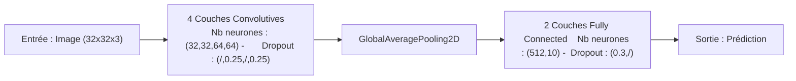

# Déploiement d’un modèle CIFAR‑10 sur microcontrôleur

> Paul Guillemin - Marc Scholkopf – Déploiement d’un DNN pré‑entraîné CIFAR‑10 sur microcontrôleur (STM32)

---

## Résumé
- **Modèle initial** : CNN (≈3,2 M paramètres, 83% accuracy) → trop lourd pour l’embarqué.
- **Cible finale** : **STM32L4R9 (Cortex‑M4F @ 120 MHz, 640 KB SRAM, 2 Mo Flash)**.
- **Nouveau modèle** : **DS‑CNN CIFAR‑Lite** (depthwise separable) ≈ **160 k** paramètres.
- **Quantification** : **INT8** + **CMSIS‑NN** via **TensorFlow Lite Micro** / **STM32Cube.AI**.
- **Résultats sur cible** : 86,7 % top‑1 | **~12,6 ms** / image | **~160 KB** de poids | **~100–120 KB** de RAM de travail | **~0,8–0,9 mJ** / inférence.

- ## Table des matières
1. [Analyse du modèle existant](#1-analyse-du-modèle-existant)
2. [Étude du microcontrôleur cible](#2-étude-du-microcontrôleur-cible)
3. [Évaluation de l’embarquabilité du modèle initial](#3-évaluation-de-lembarquabilité-du-modèle-initial)
4. [Conception et implémentation de nouveaux modèles plus optimisés](#4-conception-et-implementation-de-nouveaux-modelès-plus-optimisés)
5. [Sélection d’un nouveau microcontrôleur](#5-sélection-dun-nouveau-microcontrôleur)
6. [Arborescence du dépôt](#arborescence-du-dépôt)
7. [Reproduire les résultats](#reproduire-les-résultats)
8. [Limites & pistes](#limites--pistes)

## 1. Analyse du modèle existant

### 1.A. Présentation de la banque d'images CIFAR-10

La première question à se poser quand on souhaite concevoir un modèle d'Intelligence Artificielle (IA) est : Quelles sont les données que je vais utiliser pour entrainer et tester le modèle. Dans le cadre de notre projet, nous allons utiliser la banque d'images nommée CIFAR-10. CIFAR-10 correspond au nom attribué à une banque de données d'entrainements qui contient au total 60 000 images de taille (32 x 32)px en couleur. Ainsi, généralement, 50 000 images vont être dédiées à l'entraînement du modèle et 10 000 images seront dédiées à l'évaluation du modèle. 

La banque d'images CIFAR-10 contient, comme son nom nous l'indique, 10 classes d'images :  

| Nom de la classe | *Avion* | *Voiture* | *Oiseau* | *Chat* | *Cerf* | *Chien* | *Grenouille* | *Cheval* | *Bateau* | *Camion* |
|------------------|-------|---------|--------|------|------|-------|------------|--------|--------|--------|
| Numéro de la classe | *0* | *1* | *2* | *3* | *4* | *5* | *6* | *7* | *8* | *9* | 

Le modèle d'IA que nous allons analyser aura donc pour objectif de classer les différentes images de la banque CIFAR-10 suffisamment précisément parmi les 10 classes énoncées juste ci-dessus.  

### 1.B. Présentation du modèle d'IA

Le modèle d'intelligence artificielle que nous utilisons à l’origine pour classer les images de CIFAR-10 est un CNN (Convolutional Neural Network) de type VGG (Visual Geometry Group) adapté à CIFAR‑10. Il utilise donc des couches de convolution lui permettant de détecter les caractéristique inhérentes à chaque image pour pouvoir les classer. Il possède alors des blocs de deux convolutions 3×3 suivis d’un max‑pooling, avec un nombre de canaux qui double à chaque étage avant de terminer par deux couches entièrement connectées.
Cette organisation est efficace sur GPU, car elle exploite bien le parallélisme. On atteint alors environ 83 % de précision sur l’ensemble de validation.
Cependant, les couches denses, augmentent la taille du modèle. À 3,2 millions de paramètres, le binaire de poids atteint ~15,5 Mo.

Voici les caractéristiques du modèle d'IA initial :

- **Taille :** 5.12 Mo
- **Nombre de paramètres :** 1,344,042 paramètres
- **Précision :** 83.7%
- **Image à introduire**

### 1.C. Analyse structurelle du modèle d'IA

Le modèle d'IA est un CNN, modèle particulièrement adapté à la reconnaissance d'images. En effet, il prend en entrée, une seule image. Chaque image en entrée du modèle d'IA correspond à un tableau de 3 matrices pour les couleurs RGB et chacune des matrices est de taille 32x32 du nombre de pixels présent dans chaque image. Dans un premier temps, l'objectif, pour le modèle d'IA, est de transformer l'image d'entrée pour pouvoir faire ressortir ses caractéristiques (convolution). Celles-ci permettront alors, dans un second temps, au modèle d'IA, de comparer l'ensemble des caractéristiques de l'image aux caractéristiques des images des différentes classes. Le modèle produira établira alors les probabilités de ressemblances pour chacune des classes ce qui nous amènera à conclure de la classification faite par le modèle.
organisé de la manière suivante :

Cette organisation va lui permettre de classifier les images en entrée. 

#### 1.C.1. Les couches convolutives

Les couches convolutives du modèle vont permettre de pouvoir faire ressortir les caractéristiques de l'image en entrée. En effet, chaque couche de convolution de notre modèle est composée des éléments suivants successivement :

**Masque de convolution :** Chaque couche de convolution possède un certain nombre de masques de convolution différents. Ces masques correspondent à des matrices de taille généralement 3x3 avec une profondeur de 3 matrices (pour les couleurs RGB) qui vont naviguer sur l'ensemble des pixels de l'image d'entrée. Ainsi, des produits scalaires vont être réalisés entre les valeur du masque convolutionnel et les valeurs des pixels de l'image d'entrée. De cette manière, une nouvelle image est créée dont les valeurs de chaque pixel équivaut au produit scalaires du pixel correspondant sur l'image d'entrée par la valeur de la matrice du masque convolutionnel. Ainsi, on fabrique autant de nouvelles images qu'il y a de masques convolutionnels différents sur la couche. De cette manière, les caractéristiques de l'image vont commencer à ressortir sur les nouvelles images ainsi créées. 

**Fonction d'activation :** La fonction d'activation permet d'introduire de la non-linéarité dans les calculs réalisés par les neurones du réseau. Il existe plusieurs fonction d'activation, toutes non-linéaires, mais, dans notre cas, nous utilisons la fonction ReLU (Rectified Linear Unit. Cette fonction produit une sortie de 0 pour tout x∈]-∞;0] et x pour tout x∈[0;+∞[. Elle est simple à calculer donc tout à fait aux réseaux de neurones profonds. Elle permet une meilleure performance de calcul du réseau. C'est pourquoi elle est utilisée dans ce modèle.

**Dropout :** La notion de Dropout n'intervient pas à chaque couche convolutionnelle. Le dropout prend en argument une probabilité. En effet, pendant l'exécution du modèle, aléatoirement, la phase de Dropout va venir mettre à 0 plusieurs neurones avec une probabilité égale à la probabilité marquée en entrée. Cette phase permet notamment d'équilibrer l'entrainement du modèle et empêcher la prépondérance de certains paramètres devant d'autres. Cette phase va donc permettre "d'éteindre" certains neurones selon une certaine probabilité afin de ne pas les prendre en compte dans la suite des calculs pour diminuer leur importance. Cela permet donc d'équilibrer l'importance de tous les paramètres et donc d'optimiser la précision du modèle d'IA. Cette couche est notamment très utile lorsque l'on cherche à lutter contre le surapprentissage (overfitting) ou sous-apprentissage (underfitting) du modèle.

**Batch-normalisation :** Cette phase correspond à la normalisation des sorties selon des mini-batch de la couche convolutionnelle entre 0 et 1 pendant l'entraienement ce qui va permettre de stabiliser l'apprentissage du modèle et de poursuivre le travail de régularisation et d'équilibrage de l'ensemble des paramètres du modèle.

**Pooling :** Il s'agit de la phase finale de quelques couches convolutionnelles du modèle. Cette phase agit en tant que compression des données de sortie de la couche. En effet, en sortie de la couche, nous avons un certain nombre d'images provenant directement de l'image d'entrée égale au nombre de masques convolutionnels présents sur la couche. Afin de diminuer la taille des données du modèle, cette phase va compresser les différentes images de sorties en divisant notamment leur taille par 2 par le biais de l'utilisation d'une fonction maximum (Max-pooling). Pendant cette phase, on va reconstruire chaque image en prenant la valeur maximale des pixels présente dans un carré de (2x2)px. On compresse alors chacune des images de sortie. 

Le modèle d'IA possède au total 6 couches convolutives dont le nombre de masques convolutifs est multiplié par 2 toutes les 2 couches. Voici un schéma des couches convolutionnelles du modèle :

#### 1.C.2. Couche de vectorisation 1D

Maintenant que le processus a parcouru l'ensemble des couches convolutives, le modèle dispose de 128 images de taille (2x2)px. Chacune de ces images traite d'une caractéristique particulière de l'image d'entrée. Les 128 images permettent de décrire l'image d'entrée du modèle. Cependant, pour classifier l'image d'entrée du modèle et donc, traiter l'ensemble de ces 128 matrices 2x2, il est nécessaire d'utiliser une réseau de neurone de type "Fully Connected". Ce type de réseau s'organise selon des couches de neurones qui sont tous reliés entre eux : chaque neurone de la couche précédente est relié à tous les neurones de la couche suivante. Ce type de réseau est particulièrement adapté pour la classification de données. C'est pourquoi il constitue la 2ème partie du modèle que l'on analyse. Cependant, ce type de réseau admet, en entrée, des vecteurs de données. Or, actuellement, le modèle dispose de 128 tenseurs 2D de taille 2x2. Une couche de vectorisation 1D est alors introduite entre la partie convolutionnelle et la partie "Fully Connected" du modèle. Cette couche permet de fabriquer un vecteur 1D à partir de l'ensemble des 128 tenseurs 2D 2x2 du modèle. Ce vecteur 1D va alors être positionné en entrée de la partie Fully Connected.

#### 1.C.3. Couches Fully Connected

Dans cette partie du modèle, les neurones vont réaliser des combinaisons linaires des données du vecteur d'entrée avec l'ajout de poids et y ajouter la fonction d'activation qui va permettre d'introduire une non-linéarité ce qui est essentiel au neurone pour son bon fonctionnement. 

Dans notre modèle, il y a 3 couches Fully Connected qui permettent de classifier l'image d'entrée du modèle. La première couche dispose de 1024 neurones ayant comme fonction d'activation la fonction "ReLU" que l'on a détaillé précédemment. Cette couche dispose également d'une phase de Dropout de probabilité 0.5 qui agit exactement de la même manière et de le même but que pour les couches convolutives. Une seconde couche est présente avec 512 neurones. Celle-ci est identique structurellement parlant à la première couche. Enfin, le modèle possède une 3ème et dernière couche qui possède autant de neurones que de classe de sortie de la banque CIFAR-10. En effet, cette dernière couche va permettre de produire un vecteur de probabilités associées à chacune des classes pour lesquels l'image d'entrée du modèle pourrait appartenir. La fonction d'activation utilisée pour réaliser cela est la fonction "softmax" qui est tout à fait adaptée à cela. L'image est classée dans la classe pour laquelle le modèle d'IA a fournit la probabilité la plus élevée d'appartenance.

On en conclut alors que notre modèle d'IA est bien adapté pour la classification d'image et notamment celles de la banque CIFAR-10.

## 2. Étude du microcontrôleur cible

Maintenant que nous avons pu analyser le modèle d'IA de classification des images de la banque CIFAR-10, notre objectif va être de déterminer son embarquabilité dans la carte choisie au départ.

Tout d'abord, nous avons choisis d'utiliser la carte STM32L4R9 Discovery Kit qui possède les caractéristiques techniques suivantes :

- **MCU :** STM32L4R9AII6
- **Performances :** 120 MHz/150 DMIPS
- **Taille Flash :** 2 Mo
- **Taille SRAM :** 640 ko

Afin de pouvoir embarqué le modèle d'IA sur cette carte, il nous faut prendre en compte des considérations techniques importantes qui sont la taille de la mémoire Flash et de la SRAM de la carte par rapport à la taille du modèle à embarquer et également la performance du MCU pour qu'il soit suffisamment performant pour exécuter le modèle d'IA. En effet, dans le processus d'implémentation du modèle d'IA dans la carte, l'ensemble des poids et la structure de l'ensemble du modèle vont être stockés dans la mémoire Flash de la carte tandis que les entrées/sorties du modèle, les activations intermédiaires et les variables temporaires vont être stockés dans la SRAM. Cependant, il faut également prendre en compte le fait que le modèle d'IA ne doit prendre toute la place de la mémoire de la carte. En effet, il faut pouvoir garder de la place en mémoire pour laisser l'utilisateur construire les différents programmes nécessaires à l'utilisation du modèle d'IA ou autres.

Il va donc falloir analyser l'embarquabilité du modèle sur la carte selon les différents critères que l'on a donnés.

## 3. Évaluation de l’embarquabilité du modèle initial

### 3.A. Constatation de la non-embarquabilité du modèle

A présent, notre objectif est de déterminer si le modèle est embarquable dans le microcontrôleur. Pour cela, nous avons utilisé l'extension CubeIA de CubeIDE pour implémenter le modèle sur la carte. Cette extension a commencé par analyser le modèle afin de déterminer s'il est embarquable ou non pour notre carte. Celui-ce a donc généré un rapport d'analyse dont voici un extrait ci-dessous :

Cette analyse correspond au schéma du modèle de base suivant :

Egalement, voici les caractéristiques globales de stockage du modèle sur le microcontrôleur :

| Résultats | *Flash* | *RAM* | *Temps entrainement* | *Précision (Accuracy) sur GPU externe* | *Précision (Accuracy) sur MCU cible* |
|-----------|---------|-------|----------------------|----------------------------------------|--------------------------------------|
| Valeurs | 5.12Mo / 2Mo | 148.56ko / 192ko | 6-7sec | 83.7% | Non-implémentable en l'état |

On observe clairement que le modèle est beaucoup trop volumineux pour le microcontrôleur. Le modèle dépasse de 256% la taille de la flash de la carte. Pour ce qui est de la RAM, le modèle semble plutôt adapté. Cependant, il prend à lui seul 77.38% de la RAM du microcontrôleur ce qui est beaucoup. Notre objectif va alors être de trouver des solutions pour optimiser le modèle afin qu'il utilise moins de place dans le microcontrôleur mais, sans que le modèle ne perde trop en précision. Ce modèle ne peut donc pas être déployé dans le microcontrôleur pour des raisons de taille trop importante prise dans la mémoire du MCU.

### 3.B. Analyse des ressources prises par le modèle

D'après l'analyse précédente, on observe que les 2 couches qui prennent le plus de place dans la Flash du MCU sont les 2 premières couches Denses (2 premières couches "Fully Connected"). En effet, à elles seules, elles représentent 82% de la taille du modèle. 

Egalement, on observe que plus il y a un nombre important de masques convolutifs sur une même couche, plus la taille prise par la couche va être importante. En effet, la dernière couche convolutive avec 128 paramètres a une taille 168 fois plus importante que la première couche convolutive avec 16 paramètres. Cette dernière couche convolutive représente également à elle seule 11.5% de la taille totale du modèle.

Que ça soit pour les couches Fully Connected ou les couches convolutives, l'ajout de chaque couche a un impact important sur la taille prise par le modèle final. Ainsi, il est important de s'interroger sur la pertinance de la présence de l'ensemble des couches pour pouvoir en supprimer afin de diminuer la taille du modèle.

## 4. Conception et implémentation de nouveaux modèles plus optimisés

Maintenant que nous avons pu analyser et étudier le modèle de base, nous souhaitons nous donner pour objectif d'optimiser ce modèle de base afin de diminuer sa taille Flash et RAM le plus possible en impactant le moins possible les performances d'Accuracy du modèle de base. Pour réaliser cela, nous allons détailler, dans la suite, l'ensemble des étapes et du processus de réflexion qui nous ont amené à concevoir un modèle plus optimisé que le modèle de base permettant d'être embarqué sur un microcontrôleur et d'avoir un temps d'entrainement court. 

### 4.A. Conception et implémentation d'un 1er modèle - Remplacement de la couche Flatten (Modèle 1 et Modèle 1-1)

Pour réaliser la première optimisation du modèle de base, nous avons choisi de commencer par le remplacement de la couche "Flatten" par la couche "GlobalAveragePooling2D". "Flatten" correspond à la couche de vectorisation 1D que l'on a décrit précédemment. Cette couche aligne l'ensemble des données et paramètres de chaque image dans un vecteur 1D. Les données sont placées côte à côte. Dans le cas du modèle de base, le set d'images entrant dans la couche "Flatten" a pour taille (2,2,128) c'est-à-dire 128 images de taille 2x2 pixels. Il y a donc, au total, 128x2x2 = 512 paramètres à aligner dans un vecteur 1D. La couche "Flatten" va alors former un vecteur de sortie de taille 512. Le nombre de paramètres va alors être multiplié par le nombre de neurones dans chaque couche ce qui va entrainer une large augmentation de la mémoire RAM et de la mémoire Flash. Par exemple, pour la première couche "Dense" qui contient 1024 neurones, on aurait déjà 1024x512 = 524 288 paramètres. Notre objectif est donc de diminuer le nombre de paramètres propagés dans la partie "Fully Connected" du modèle.

La couche "GlobalAveragePooling2D", pour sa part, utilise une autre méthode de vectorisation des données. En effet, cette couche va réaliser la moyenne de l'ensemble des valeurs des pixels d'une image et générer, en sortie, une valeur moyenne par image. Ainsi, appliqué au modèle de base, cette couche recevrait un set d'images de taille (2,2,128) et générerait, en sortie, une vecteur 1D de taille 128. En effet, le set d'images contient 128 images de 2x2 pixels chacune. La couche "GlobalAveragePooling2D" va faire une moyenne de l'ensemble des paramètres de chacune des images. Ainsi, au lieu d'aligner les 4 paramètres de chacune des images, cette couche ne va aligner qu'un seul paramètre par image correspondant à la moyenne des 4 paramètres qui constituent l'image à la base. On obtient alors un vecteur 1D de 128 paramètres en sortie de cette couche. 

Voici le schéma du nouveau modèle intégrant la nouvelle couche de vectorisation 1D :

Voici les courbes de Loss et d'Accuracy associé aux entrainements et aux tests du modèle ainsi optimisé :

En analysant les courbes de Loss et d'Accuracy, par comparaison avec le modèle de base, on remarque que la nouvelle couche "GlobalAveragePooling2D" permet de rendre le modèle plus résistant face à l'overfitting (ce nouveau modèle n'a plus d'overfitting tandis que le modèle de base en a). Egalement, cette couche tend à améliorer l'Accuracy du modèle puisqu'elle est à plus de 83%. Cette première optimisation est donc validée.

Egalement, grâce à l'optimisation de la couche "Flatten" par remplacement de la couche "GlobalAveragePooling2D", on a divisé par 4 le nombre de paramètres entrant dans la partie "Fully connected" du CNN ce qui a pour conséquence une diminution de 29.1% de la taille du modèle dans la Flash. Le nouveau modèle a donc une taille de 3.63 Mo en Flash et une précision de 83.13%.

En réalisant l'analyse de l'importation du nouveau modèle sur CubeAI adapté à notre MCU cible, les résultats montrent toujours que la taille en Flash est trop importante même si elle a diminué et la taille en RAM est correcte même si trop importante. En effet, notre modèle occupe 77.5% de la RAM totale ce qui ne laisse que peu de place à des applications utilisateurs en plus et au fonctionnement du système lui-même.

| Résultats | *Flash* | *RAM* | *Temps entrainement* | *Précision (Accuracy) sur GPU externe* | *Précision (Accuracy) sur MCU cible* |
|-----------|---------|-------|----------------------|----------------------------------------|--------------------------------------|
| Valeurs | 3.64Mo / 2Mo | 148.71ko / 192ko | 7sec | 83.13% | Non-implémentable en l'état |

On a remarqué que le remplacement de la couche "Flatten" a augmenté la taille du modèle en RAM de 0.15ko et son temps d'entrainement global de 0.3-0.5 secondes. En effet, la couche "GlobalAveragePooling2D" réalisant plus de calculs en faisant les moyennes des paramètres des images que la couche "Flatten" qui ne fait qu'aligner les paramètres dans un vecteur, ceci explique ces effets. 

### 4.B Conception et implémentation d'un 2ème modèle - Suppression de couches et neurones superflus (Modèle 2, Modèle 2-1

#### 4.B.1. Suppression de couches superflus (Modèle 2)

Nous souhaitons à présent commencer l'optimisation du nouveau modèle précédent en supprimant des couches et neurones qui pourraient être superflus dans le modèle. Pour cela, nous avons analysons le nombre de paramètres par couche dans le modèle. En effet, notre objectif serait de supprimer le plus de paramètres possible ce qui limiterait la taille prise par notre modèle. 

Pour commencer, nous supprimons les 2 dernières couches convolutives qui comportent chacune 128 neurones du CNN et qui représentent, à elles seules, 17.3% de la taille totale du modèle. Le schéma du modèle devient alors : 

Puis, nous faisons le choix de supprimer la premère couche "Dense" qui comporte 1024 neurones et qui représente, à elle seule, plus de 50% de la taille totale du modèle. Le schéma du modèle devient alors : 

On souhaite entrainer ce nouveau modèle afin de le tester pour évaluer l'impact qu'a eu la suppression de l'ensemble de ces couches et neurones. Voici les courbes de Loss et d'Accuracy de ce nouveau modèle :

On remarque que le modèle possède une Accuracy (de 77%) plus basse que le modèle précédent et qu'il n'y a pas d'overfitting, mais, que le modèle est moins efficace sur les données d'entrainement que sur les données de test. Egalement, on a choisit de l'intégrer sur CubeAI afin de vérifier la taille Flash et RAM que ce modèle prendrait sur le MCU cible et voici les résultats obtenus :

| Résultats | *Flash* | *RAM* | *Temps entrainement* | *Précision (Accuracy) sur GPU externe* | *Précision (Accuracy) sur MCU cible - (100 premières images)* |
|-----------|---------|-------|----------------------|----------------------------------------|-------------------------------------------------------------|
|  Valeurs  | 425.8Ko / 2Mo | 145.93ko / 192ko | 5-6sec | 77.72% | 71% |

On remarque que la taille prise par ce nouveau modèle dans la Flash est bien moindre par rapport au précédent modèle. En effet, en supprimant des couches au modèle, on a également supprimé des neurones. En sachant que le nombre de paramètres d'entrée d'une couche va être multiplié par le nombre de neurones présents (car chacun des neurones reçoit l'ensemble des paramètres à leur entrée), cela augmente considérablement le nombre de paramètres total présent dans le modèle. En supprimant des couches et, par conséquent, des neurones, on réduit considérablement le nombre de paramètres stockés dans la mémoire Flash. On remarque que l'on a diminué la mémoire RAM de 2.78 Ko et que le temps d'entrainement a également diminué de 1-1.5 secondes par rapport au modèle précédent. Cela s'explique par la simplification du modèle que l'on produit en supprimant des couches et des neurones. Comme il y a moins de paramètres à modifier, l'entrainement est alors plus rapide.

#### 4.B.1. Ajustement du Dropout pour l'entrainement (Modèle 2-1)

Comme on l'a vu dans les résultats du modèle précédent, le modèle ne s'entraine pas assez ce qui explique pourquoi le modèle est plus précis sur les données de validation plutôt que sur celles d'entrainement. Mais, cela signifie également que l'on peut encore gagner en précision sans modifier quelque couche ou neurone que se soit. Pour augmenter l'apprentissage du modèle, nous devons augmenter le nombre de neurones qui fournissent des résultats pendant l'entrainement. Le paramètre qui agit justement sur le nombre de neurones qui fournissent des résultats pendant l'entrainement est le Dropout. Il nous faut diminuer la valeur du Dropout.

Nous allons donc modifier en diminuant les valeurs de probabilité dans les couches de "Dropout" afin qu'il y ait moins de neurones éteint aléatoirement pendant l'entrainement. Ceci va alors permettre au modèle de mieux apprendre sur les données d'entrainement car il aura plus de neurones actifs disponibles et donc, d'améliorer son Accuracy globale. Pour ajuster les bonnes valeurs de Dropout, nous avons réalisé une bonne dizaine de tests afin d'arriver à la conclusion que l'ensemble des probabilités des couches "Dropout" doit être fixé 0.2 qui est la valeur la plus optimale pour l'apprentissage de notre modèle. Voici donc le schéma représentatif de notre modèle 2-1 :

On souhaite maintenant entrainer ce nouveau modèle afin de vérifier que la modification de la valeur des Dropout a bien corriger le sous-apprentissage. Voici les courbes de Loss et d'Accuracy obtenues :

On remarque que l'Accuracy du modèle a augmenté de 77% à 79% donc, très proche de l'Accuracy initial qui était de 80%. On remarque également qu'il n'y a pas d'overfitting et que le modèle a bien atteint son point optimal d'apprentissage. La méthode de correction par variation du taux de Dropout a donc bien fonctionné.

| Résultats | *Flash* | *RAM* | *Temps entrainement* | *Précision (Accuracy) sur GPU externe* | *Précision (Accuracy) sur MCU cible - (100 premières images)* |
|-----------|---------|-------|----------------------|----------------------------------------|-------------------------------------------------------------|
|  Valeurs  | 425.8Ko / 2Mo | 145.93ko / 192ko | 5-6sec | 79.04% | 82% |

Maintenant que nous avons supprimé des couches du modèle, nous allons supprimer des neurones aux couches restantes. Nous commençons par réduire le nombre de neurones de la première des 2 couches Denses restantes de 512 à 256 neurones afin de diviser par 4 le nombre de paramètres vectorisés provenant des couches convolutives. Les couches Dense sont très lourdes en nombre de paramètres ce qui explique nous en supprimons des neurones. De plus, nous divisons par 

#### 4.B.2 Implémentation du modèle sur le MCU cible

## 5. Sélection d'un nouveau microcontrôleur

